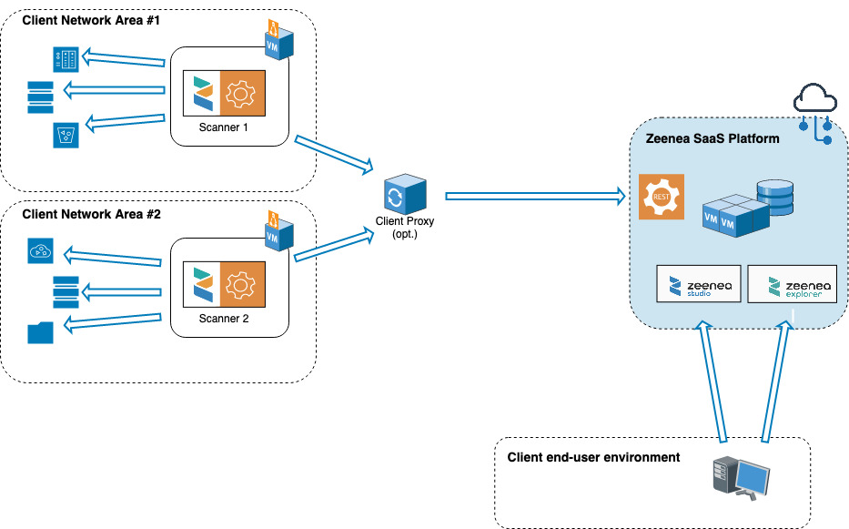

<!-- #p100003 -->
# Zeenea Scanner Setup

<!-- #p100009 -->
## Architecture Overview

<!-- #p100024 -->
<!-- #p100021 -->

<!-- #p100036 -->


- <!-- #p100042 -->
  Each instance of Zeenea Scanner must be deployed in your infrastructure.

- <!-- #p100051 -->
  The Scanner's primary responsibility is to collect metadata from the systems you choose to connect to.

- <!-- #p100060 -->
  The communication between the Scanner and your systems is initiated by the Scanner. It uses different protocols depending on the nature of the system with which the Scanner is communicating.

- <!-- #p100069 -->
  The Scanner relies on connectors dedicated to communication with a particular type of system (e.g. Oracle, Table, Amazon S3 connectors, ...).

- <!-- #p100078 -->
  The Scanner communicates with the Zeenea platform only on its own initiative: no incoming feed is required.

- <!-- #p100087 -->
  The communication between the Scanner and the Zeenea platform is done via the HTTPS protocol (on default port: 443), in a secure way (TLS) and via an authentication based on an API key generated by you.

- <!-- #p100096 -->
  This outgoing communication can optionally pass through a proxy.

> <!-- #p100114 -->
> **Note:** The scanner process is expected to **run continuously** with special attention during the execution of its sub-processes (by default every night) and during the entire time users may use Zeenea platform.

<!-- #p100123 -->
## Requirements for Installation

<!-- #p100129 -->
### Hardware Requirements

<!-- #p100135 -->
Zeenea scanners must be installed on x86-64 Linux servers or Windows servers.

<!-- #p100141 -->
When running the scanner on a Linux, server, the following configurations are supported:

- <!-- #p100147 -->
  Red Hat Enterprise Linux Server &gt;= 6.8

- <!-- #p100156 -->
  CentOS &gt;= 7.3

- <!-- #p100165 -->
  Ubuntu Server LTS &gt;= 16.04

- <!-- #p100174 -->
  Amazon Linux &gt;= 2017.03

<!-- #p100186 -->
Standard sizing for a server:

- <!-- #p100192 -->
  4 cores

- <!-- #p100201 -->
  4 GB RAM minimum, 8+ GB recommended

- <!-- #p100210 -->
  20 GB of disk space

- <!-- #p100219 -->
  The server can be virtually hosted.

<!-- #p100231 -->
## Software Dependencies

<!-- #p100240 -->
**The current Scanner version requires Java 11**. OpenJDK or Oracle JDK can be installed indifferently.

<!-- #p100249 -->
:::tip Remember to validate your installation by checking it with the command `# java --version`. :::

<!-- #p100255 -->
You should see in reply the version number of Java and be able to verify that it is one of the supported versions.

<!-- #p100261 -->
## Network Requirements

<!-- #p100267 -->
The Zeenea Scanner process will establish connections to the systems it is connected to and from which it will need to extract metadata.

<!-- #p100273 -->
Depending on the platforms, the protocols will vary and the flow openings will have to be carried out accordingly.

<!-- #p100279 -->
The Zeenea Scanner process will also exchange with the Zeenea SaaS platform. The network flow between the Zeenea Scanner process and the platform will therefore have to be allowed. The exchanges are always initiated by the Scanner process and are done in HTTPS. A proxy (with a possible authentication) can be configured.

<!-- #p100285 -->
## Necessary Local Rights

<!-- #p100291 -->
The Zeenea Scanner service must be run with a dedicated user account (no login shell user account).

<!-- #p100297 -->
Under Linux, it is usually advisable to create a group with the same name.

<!-- #p100303 -->
This user must have read and/or write rights to the entire directory and subdirectories of the Scanner.

<!-- #p100309 -->
## Installation

<!-- #p100318 -->
Our scanner is regularly updated to correct bugs and add improvements. **We recommend updating it at least every 6 months**.

<!-- #p100324 -->
### Linux Environnement

<!-- #p100330 -->
Unless the binary is specifically provided to you by Zeenea, the Scanner can be downloaded as an archive by using a dedicated API entry point or via the Scanners monitoring page in Zeenea (Administration interface) where a download link is proposed.

<!-- #p100336 -->
If you decide to download the Scanner using the API, you have to create a dedicated API key. See Managing API Keys.

<!-- #p100342 -->
Then, use the previously created API key in the following command:

<!-- #p100351 -->
`curl -L -H "X-API-SECRET: $APISECRET" "https://$hostname/studio/api-v1/agent/get-agent" -o scanner.tar.gz`

<!-- #p100357 -->
With:

- <!-- #p100366 -->
  `$APISECRET`: the secret of the API key

- <!-- #p100378 -->
  `$hostname`: your instance. For example: myenv.zeenea.app

  <!-- #p100384 -->
  ```
  :::note
  The API Key used for this request must be of type "Scanner".
  :::
  ```

<!-- #p100396 -->
Once the archive is downloaded, uncompress it in the folder of your choice, then proceed with the configuration.

<!-- #p100402 -->
### Microsoft Windows: Install as a Service

<!-- #p100408 -->
Windows compatible versions of the scanner start with version 51.

<!-- #p100414 -->
#### Scanner 69 and Later

<!-- #p100420 -->
Installation of the Windows service uses Apache Procrun, part of the Apache Commons Daemon suite. From version 69 onwards, binaries for x86\_64 architectures are supplied. You'll find them in the scanner's bin folder.

<!-- #p100432 -->
To install and update the Windows service, use the `bin\zeenea-service.bat` command, which will call the `bin\prunsrv.exe` command.

<!-- #p100441 -->
`zeenea-service.bat` offers the following options:

<!-- multiline -->
| &gt; <!-- #p100447 --> | &gt; <!-- #p100459 -->                                                                                                                                                                              | &gt; <!-- #p100471 -->                      |
| &gt; Option            | &gt; Description                                                                                                                                                                                    | &gt; Default                                |
| ------------------- | ------------------------------------------------------------------------------------------------------------------------------------------------------------------------------------------------ | ---------------------------------------- |
| &gt; <!-- #p100489 --> | &gt; <!-- #p100504 -->                                                                                                                                                                              | &gt; <!-- #p100525 -->                      |
| &gt; `--JvmDll`        | &gt; Path to the Windows DLL to be used. If the argument is not specified, the DLL will be defined using the `%JAVA_HOME%` environment variable or the path to the "java" executable found in Path. | &gt; <!-- #p100489 -->                      |
|                     |                                                                                                                                                                                                  |                                          |
| &gt; <!-- #p100543 --> | &gt; <!-- #p100555 -->                                                                                                                                                                              | &gt; <!-- #p100570 -->                      |
| &gt; `--ServiceName`   | &gt; Windows service name.                                                                                                                                                                          | &gt; `ZeeneaScanner`                        |
|                     |                                                                                                                                                                                                  |                                          |
| &gt; <!-- #p100588 --> | &gt; <!-- #p100600 -->                                                                                                                                                                              | &gt; <!-- #p100615 -->                      |
| &gt; `--ServiceUser`   | &gt; Name of the Windows user running the service.                                                                                                                                                  | &gt; `LocalSystem`                          |
|                     |                                                                                                                                                                                                  |                                          |
| &gt; <!-- #p100633 --> | &gt; <!-- #p100720 -->                                                                                                                                                                              | &gt; <!-- #p100735 -->                      |
| &gt; `--LogLevel`      | &gt; Procrun log level. Values can be:<ul><li>Error</li><li>Warn</li><li>Info</li><li>Debug</li><li>Trace</li></ul>                                                                                 | &gt; `Info`                                 |
|                     |                                                                                                                                                                                                  |                                          |
| &gt; <!-- #p100753 --> | &gt; <!-- #p100765 -->                                                                                                                                                                              | &gt; <!-- #p100777 -->                      |
| &gt; `--LogPath`       | &gt; Location of procrun log files.                                                                                                                                                                 | &gt; "logs" subfolder in the scanner folder |
|                     |                                                                                                                                                                                                  |                                          |
| &gt; <!-- #p100795 --> | &gt; <!-- #p100807 -->                                                                                                                                                                              | &gt; <!-- #p100822 -->                      |
| &gt; `--JvmMx`         | &gt; Maximum size of the Java memory pool in MB.                                                                                                                                                    | &gt; `4096`                                 |
|                     |                                                                                                                                                                                                  |                                          |
|
|                     |                                                                                                                                                                                                  |                                          |

<!-- #p100846 -->
Once the service has been set up, you can use `bin\prunmgr.exe` to monitor the service.

<!-- #p100852 -->
Run the following command with the service name used during registration to obtain a process monitoring icon in the system tray. Click on it to open the service settings window.

<!-- #p100861 -->
`bin\prunmgr.exe //MS//`

<!-- #p100867 -->
#### Scanner 68 and Previous

1. <!-- #p100873 -->
   Download windows binaries:

   1. <!-- #p100882 -->
      Go to [https://downloads.apache.org/commons/daemon/binaries/](https://downloads.apache.org/commons/daemon/binaries/).

   2. <!-- #p100897 -->
      In the `windows` folder, download the archive `commons-daemon-1.3.4-bin-windows.zip`.

2. <!-- #p100912 -->
   Unzip the archive.

3. <!-- #p100921 -->
   Copy the following files under the root folder of the Scanner:

   - <!-- #p100930 -->
     `prunmgr.exe`

   - <!-- #p100939 -->
     Depending on your architecture:

     - <!-- #p100948 -->
       If 32bits, copy `prunsrv.exe` there.

     - <!-- #p100960 -->
       If 64bits, copy `prunsrv.exe` from "/amd64" folder there.

4. <!-- #p100987 -->
   Using the MS DOS terminal, change your current directory to the root folder of the Scanner. Then execute the launch script by using this command `./bin/zeenea-service.bat` with, as a parameter, the path to jvm.dll (should be under the following JRE's folder `/bin/server/jvm.dll`)

   1. <!-- #p100999 -->
      Command : `./bin/zeenea-service.bat "C:/path/to/dll/jvm.dll` 
         `([--JvmMs 123] [--JvmMx 123] [--JvmSs 123]` These are optional arguments to customize the amount of memory the JVM may allocate to different purposes. See JVM documentation for more information.

   2. <!-- #p101008 -->
      Once the command is executed, it should return without any error.

   3. <!-- #p101017 -->
      You can verify the status of the service using this command: "./prunmgr.exe //MS//ZeeneaScanner". An icon should appear in your Windows task bar.

<!-- #p101038 -->
`prunmgr.exe` : User Interface to manage and configure services once created.

<!-- #p101047 -->
`prunsrv.exe` : Command line application to manage (edit) services.

<!-- #p101053 -->
:::note\[Notes\]

1. <!-- #p101068 -->
   You can rename `prunmgr.exe` to `ZeeneaScanner.exe` if you intend to run the application from Windows Explorer (instead of the Command Line). It will act as if it was this command: `./prunmgr.exe //MS//ZeeneaScanner`.

2. <!-- #p101077 -->
   You can manage your service status using command available from procrun. See here for more information: \[https://commons.apache.org/proper/commons-daemon/procrun.html(https://commons.apache.org/proper/commons-daemon/procrun.html).

3. <!-- #p101086 -->
   Specific service log files are available in the "/service-logs" folder in your Scanner folder tree.

<!-- #p101098 -->
:::

<!-- #p101104 -->
## Configuration

<!-- #p101110 -->
### Name the Scanner

<!-- #p101116 -->
The name will be the identifier of the Scanner. It will be used by Zeenea to distinctly identify the Scanner and allow the Connections associated with it to be identified.

- <!-- #p101122 -->
  Only name the scanner using alphanumeric characters, underscores (\_), and and hyphens (-).

- <!-- #p101131 -->
  Don’t use special characters, spaces characters, ...

- <!-- #p101140 -->
  The name can be changed afterwards. However, in that event, Zeenea will keep track of a Scanner with the previous name with an offline status.

<!-- #p101152 -->
:::tip Select a name and avoid changing it. :::

<!-- #p101158 -->
Zeenea Scanner name is defined in a file named agent-identifier under the main directory of the scanner. Create such a file or just copy paste the previous one if you are upgrading the scanner to a new version and enter in this file the name that the Scanner will be given (on a single line).

<!-- #p101164 -->
Sample command to create this file:

<!-- #p101173 -->
`echo "my-hadoop-cluster-scanner" &gt; agent-identifier`

<!-- #p101182 -->
The value `my-hadoop-cluster-scanner` in the example above is the name this Scanner will have.

<!-- #p101188 -->
## Scanner Configuration

<!-- #p101200 -->
The configuration is done via the configuration file `application.conf` located in the `conf/` directory

<!-- #p101212 -->
By default, the file is named `application.conf.template`. It must be renamed to (or duplicated with the name) `application.conf`.

<!-- #p101218 -->
### Enter your Platform Address

<!-- #p101227 -->
You must enter the address of your Zeenea platform to allow the Scanner to retrieve the metadata. This is done by enhancing the `zeenea-url` property with the URL of your platform in the form https://myenv.zeenea.app.

<!-- #p101233 -->
Example:

<!-- #p101242 -->
`zeenea-url = "https://myenv.zeenea.app"`

<!-- #p101248 -->
### Enter Identifiers

<!-- #p101254 -->
The Scanner authenticates itself to the platform with an "Scanner" type API key containing a pair of information (id and secret). To generate an API key, refer to Managing API Keys.

<!-- #p101269 -->
The identifier and the secret must be entered in the node `api-key`, under `id` and `key` respectively.

<!-- #p101275 -->
Example:

<!-- #p101281 -->
```
authentication {
  api-key {
    secret = "eyJ0eXAiOiJKV1QiLCJhbGciOiJSUzI1NiJ9.eyJpc3MiOiJ6ZWVuZWEiLCJhdWQiOiJ6..."
  }
}
```

<!-- #p101287 -->
## Process Configuration (optional)

<!-- #p101293 -->
The frequency of execution of the various automatic processes carried out by the scanner is configurable under the "automation" node.

<!-- #p101299 -->
:::note It is recommended to keep the default values except in very special cases. :::

<!-- #p101305 -->
Here are the processes triggered by the scanner:

- <!-- #p101314 -->
  **launch-inventory**: Build a fresh new inventory of all items the connectors support from the source system. The inventory is what a Data Steward will see when opening the import wizard. By default, this process runs every 24H.

- <!-- #p101326 -->
  **update-schema**: For all the synchronized items already imported into the data catalog (Datasets, Fields, Visualizations), update their source metadata from the source system. By default, this process runs every 24H.

- <!-- #p101338 -->
  **synchronize**: Some connectors don't use an inventory to let the Data Steward import the items they want, but instead synchronize automatically all the items from the source system with Zeenea. This process will trigger these connectors. By default, this process runs every 24H.

- <!-- #p101350 -->
  **collect-fingerprint**: Compute fingerprint and data profiling metrics for items having this option activated. By default, this process runs once a week.

- <!-- #p101362 -->
  **collect-data-sample**: Collect a data sample from the last 30 entries of each Dataset, if the option is enabled in the Administration interface. By default, this process runs once a week.

<!-- #p101374 -->
:::note Each process execution is configured with the help of a cron expression. Please, read carefully this article describing its syntax: https://www.quartz-scheduler.org/documentation/quartz-2.3.0/tutorials/crontrigger.html :::

<!-- #p101380 -->
## Configure a Proxy (optional)

<!-- #p101386 -->
It is possible to configure a proxy that will be used by the Scanner during exchanges with the Zeenea platform.

<!-- #p101392 -->
The configuration portion named proxy-configuration should be uncommented (\# characters should be removed) while respecting the opening and closing braces.

<!-- #p101398 -->
Refer to your documentation to find out which proxy to use and how to configure it.

<!-- #p101404 -->
The parameters to be provided will be at least:

- <!-- #p101413 -->
  `host`: the proxy address

- <!-- #p101425 -->
  `port`: the proxy listening port

<!-- #p101437 -->
Other parameters may need to be filled in as well. In this case, uncomment them and value each one.

<!-- #p101443 -->
```
proxy-configuration {
    host = "proxy-server"
#    The port of the proxy server
    port = 3128
#    The protocol of the proxy server.  Use "http" or "https". Defaults to "http" if not specified.
#    protocol = "http"
#    The principal (aka username) of the credentials for the proxy server
#    principal = null
#
#    The password for the credentials for the proxy server
#    password = null
}
```

<!-- #p101449 -->
## Modify Default Protocol (HTTP REST vs gRPC)

<!-- #p101455 -->
### Why Should you mModify This?

<!-- #p101461 -->
The default REST based protocol is very convenient as it works almost everywhere. But, in some situations, the scanner may face one of its limits: the maximum size of the requests payload.

<!-- #p101467 -->
gRPC protocol is not concerned by this limitation. Thus it could make sense to consider gRPC in case of very important inventories being built.

<!-- #p101473 -->
### Is my Architecture Ready for gRPC?

<!-- #p101479 -->
gRPC uses HTTP/2 as its transport protocol. Your infrastructure MUST support HTTP/2 from end to end. In case of any doubt, please read your proxies documentation to validate they do support HTTP/2 properly.

<!-- #p101485 -->
When configured to use gRPC, the scanner will communicate with a unique central entry point: grpc.zeenea.app. Make sure this address is accessible for the scanner.

<!-- #p101491 -->
### How do I Enable and Configure gRPC?

<!-- #p101497 -->
In order to activate gRPC, you just have to add the following line to your scanner configuration file:

<!-- #p101506 -->
`protocol = grpc`

<!-- #p101512 -->
Once the scanner is restarted, it will start using gRPC to communicate with your Zeenea platform.

<!-- #p101518 -->
In case you need to specify a proxy, you can do this by editing your scanner configuration file this way:

<!-- #p101524 -->
```
grpc {
  host = ""
  port = 
  tenant = ""
}
```

<!-- #p101530 -->
## Connections Configuration

<!-- #p101536 -->
You have to pay attention to the ability for the scanner to open a connection to the platforms it should communicate with: network routes should be enabled.

<!-- #p101542 -->
For more about our connectors, see Zeenea Connector Downloads.

<!-- #p101548 -->
New connections are defined using a dedicated configuration file under the connections folder of the Scanner.

<!-- #p101554 -->
Learn how to create, manage or delete a connection.

<!-- #p101560 -->
## Using a Secret Manager

<!-- #p101566 -->
Starting from Scanner 73, you can rely on a Secret Manager to provide sensitive information to your connections, like your credentials.

<!-- #p101572 -->
Starting from Scanner 76, the Secret Manager can also be used for the Scanner configuration (except information defined inside the "secret-manager" node).

<!-- #p101578 -->
You can only define a single Secret Manager per Scanner.

<!-- #p101584 -->
Currently, the Scanner supports 2 different Secret Manager types:

- <!-- #p101590 -->
  AWS Secret Manager

- <!-- #p101599 -->
  A local file containing your secrets

<!-- #p101611 -->
### AWS Secret Manager

<!-- #p101617 -->
Configuration example:

<!-- #p101623 -->
```
secret-manager {
  key = "my-first-secret" # optional
  provider = "aws-secrets-manager"
  configuration = {
    region = "eu-west-3"
#   access_key_id = ""
#   secret_access_key = ""
#   profile = ""
  }
#  proxy {
#    scheme = "http"
#    hostname = "proxy"
#    port = 8888
#    username = "username"
#    password = "pass"
#  }
}
```

<!-- #p101629 -->
Depending on the scanner's host credentials, you may (or may not) need to provide some of the parameters defined in provider-configuration. The Scanner will try to use any existing Instance Role, Environment Variable, or AWS Configuration File being available.

<!-- #p101635 -->
:::note The proxy object is optional. :::

<!-- #p101641 -->
### File Secret Manager

<!-- #p101647 -->
Configuration example:

<!-- #p101653 -->
```
secret-manager {
  key = "my-first-secret" # optional
  provider = "file"
  configuration = {
    file-path = "/path/to/file"
  }
}
```

<!-- #p101659 -->
Exclusively locally accessible files can be used here.

<!-- #p101665 -->
Such a file must adopt the following format:

<!-- #p101671 -->
```
my-first-secret {
  key = "value"
  some.complex.key = "again value"
  token_databricks = "token secret"
  s0m3-s3parat3d-k3y = "some value"
  MY_URL = "http://localhost:8080""
  filename = "zeenea-scanner-snapshot.json"
}
scanner_snowflake {
  kh12345.eu-west-1.jdbc_url = "jdbc:snowflake://nnmfbau-kh90823.snowflakecomputing.com/""
  kh12345.eu-west-1.username = SCANNER
  kh12345.eu-west-1.password = value
  kn98765.eu-west-1.jdbc_url = "jdbc:snowflake://nnmfbau-kn67972.snowflakecomputing.com/""
  kn98765.eu-west-1.username = SCANNER
  kn98765.eu-west-1.password = value
}
```

<!-- #p101677 -->
### Secret Injection Syntax

<!-- #p101683 -->
Your connection file must contain a secret\_manager object and can then use the following syntax to benefit from the Secret Manager:

<!-- #p101692 -->
`${secret_manager.}`

<!-- #p101701 -->
Here is an example (based on the local file sample above) **for a connection**:

<!-- #p101707 -->
```
name = "example-name"
code = "example-code"
connector_id = "databricks-unitycatalog"
secret_manager {
  enabled = true
  key = "my-first-secret"
}
connection {
  url = "https://dbc-91ebdd08-4e3a.cloud.databricks.com""
  token = ${secret_manager.token_databricks}
}
```

<!-- #p101719 -->
**Starting from Scanner v76**, the Scanner configuration (`./conf/application.conf`) can also use secrets managed by the Secret Manager (as well as regular ENV variables, not managed by the Secret Manager).

<!-- #p101725 -->
There is no need to define anything but the secret-manager, as explained above, and then use the same injection syntax.

<!-- #p101734 -->
For example, in the `application.conf` file, the API Key can be provided like this:

<!-- #p101740 -->
```
authentication {
    api-key {
         secret = ${secret_manager.api_key}
    }
}
```

<!-- #p101746 -->
## Hooks Configuration

<!-- #p101752 -->
You can configure hooks that will be called after a scanner job ends.

<!-- #p101758 -->
Learn how to configure a hook after a scanner job.

<!-- #p101764 -->
## Dry Run

<!-- #p101770 -->
The scanner can be configured in dry-run mode.

<!-- #p101776 -->
The purpose of this mode is to test the inventory of the connections.

<!-- #p101782 -->
The scanner won't communicate with the platform and the inventory will be written to a file.

<!-- #p101791 -->
To enable it, you simply need to set the protocol to `file` and define a result file path.

<!-- #p101797 -->
```
protocol = file
file {
    file-path = "/opt/zeenea-scanner-74/file-extract.json"
}
```

<!-- #p101806 -->
To execute the test, run the scanner with the `inventory` argument:

<!-- #p101812 -->
```
  `$ bin/zeenea-scanner inventory`
```

<!-- #p101818 -->
## Start the Scanner

<!-- #p101824 -->
### Simple Start (test only)

<!-- #p101833 -->
The `./bin/zeenea-scanner` script is used to start the Scanner.

<!-- #p101839 -->
This script must be started from the root directory of the Scanner.

<!-- #p101845 -->
This script can be executed with different options. For example, you can define the sizing of the JVM. All options are described in the help, via the -h option:

<!-- #p101854 -->
`# ./bin/zeenea-scanner -h`

<!-- #p101860 -->
It is important to allocate enough memory to the JVM. 8 GB are recommended.

<!-- #p101866 -->
In the following example, the command starts the Scanner process. The process will remain active even after logging out (nohup command) and the JVM will have a 8GB memory allocation.

<!-- #p101875 -->
`# nohup ./bin/zeenea-scanner -J-Xmx8g &amp;`

<!-- #p101881 -->
## Process Configuration in systemd

<!-- #p101887 -->
Scanning, especially in a production environment, is best defined as a process managed by systemd (or equivalent, depending on your OS).

<!-- #p101893 -->
We therefore strongly recommend this configuration.

<!-- #p101899 -->
### Steps to Follow

1. <!-- #p101905 -->
   Copy and adapt the unit file (see example below).

2. <!-- #p101914 -->
   Reload the systemd configuration.

3. <!-- #p101923 -->
   Activate zeenea-scanner.

4. <!-- #p101932 -->
   Start the service

<!-- #p101944 -->
### Example of Unit Files

<!-- #p101950 -->
:::note This unit file must be adapted to your environment. :::

<!-- #p101956 -->
#### Name:

<!-- #p101962 -->
zeenea-scanner.service

<!-- #p101968 -->
#### Folder:

- <!-- #p101977 -->
  If installing manually: `/etc/systemd/system`

- <!-- #p101986 -->
  If installing via packaging system:

  - <!-- #p101995 -->
    RHEL, CentOS: `/usr/lib/systemd/system`

  - <!-- #p102007 -->
    Debian, Ubuntu: `/lib/systemd/system`

  <!-- #p102019 -->
  :::note\[Notes\]

- <!-- #p102028 -->
  The user and group named in the file must have been created.

- <!-- #p102037 -->
  The path to Zeenea must match or be adapted.

- <!-- #p102046 -->
  The parameters passed to the Zeenea process must be adapted to your context.

<!-- #p102058 -->
:::

<!-- #p102064 -->
#### Sample file:

<!-- #p102070 -->
```
[Unit]
Description=Zeenea Scanner
After=network-online.target

[Service]
Type=simple
ExecStart=/opt/zeenea/bin/zeenea-scanner -J-Xmx4g
WorkingDirectory=/opt/zeenea
User=zeenea
Group=zeenea
LimitNOFILE=524288
SuccessExitStatus=129 130 143

[Install]
WantedBy=multi-user.target
```

<!-- #p102076 -->
## Useful Commands

- <!-- #p102085 -->
  Activate the service: `sudo systemctl enable zeenea-scanner`

- <!-- #p102097 -->
  Start the service: `sudo systemctl start zeenea-scanner`

- <!-- #p102109 -->
  Reload systemd configuration: `sudo systemctl daemon-reload`

- <!-- #p102121 -->
  Access systemd logs: `journalctl`

- <!-- #p102133 -->
  Access to systemd logs limited to the service: `journalctl -u zeenea-scanner`

<!-- #p102154 -->
If you experience issues while configuring your scanner, refer to [Troubleshooting Scanners and Connections](zeenea-troubleshooting.md# "Troubleshooting Scanners and Connections")

