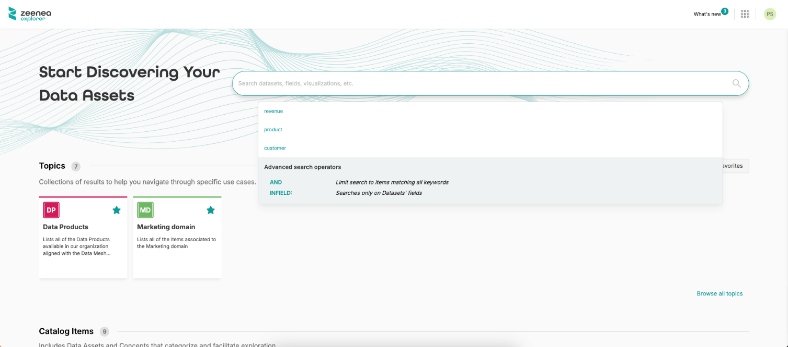
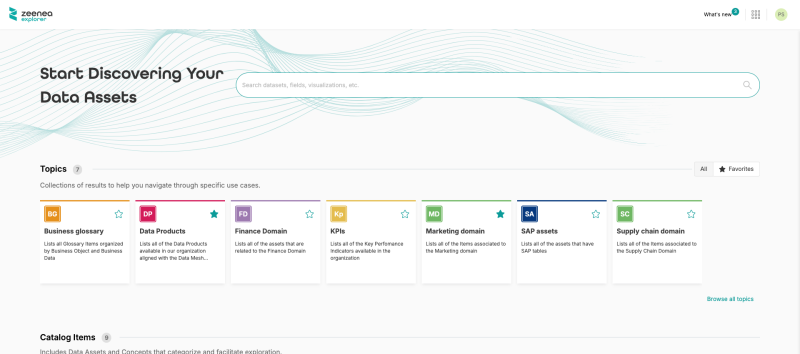
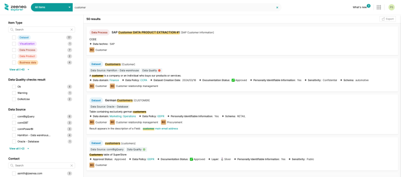
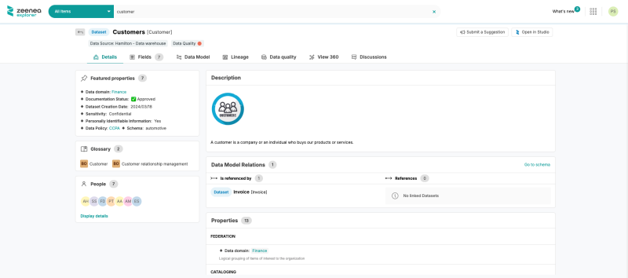

<!-- #p100003 -->
# As a Data Explorer

<!-- #p100009 -->
As a Data Explorer, you have access to our dedicated Data discovery application: Zeenea Explorer.

<!-- #p100015 -->
Read more: Zeenea Explorer Overview

<!-- #p100021 -->
## Log in to the platform

<!-- #p100027 -->
To access Zeenea, you must be authorized to log in.

<!-- #p100033 -->
You will have to enter the login/password combination which will have been sent to you by email by the administrators.

<!-- #p100039 -->
## Search

<!-- #p100045 -->
From the home page, you can make your first search through the items in the catalog.

<!-- #p100051 -->
After a few uses, your last searches will also appear when clicking on the search bar.

<!-- #p100057 -->
Read more: Search and discover items in Zeenea Explorer

<!-- #p100069 -->

<!-- #p100075 -->
You can also explore the content of the catalog by entering either through the topics your organization may have defined, the assets types or the glossary, grouping the Business Terms defined by your company and associated with your data assets.

<!-- #p100087 -->

<!-- #p100093 -->
Read more: Topic

<!-- #p100099 -->
## Filter

<!-- #p100105 -->
After launching a search, the search results page will appear.

<!-- #p100111 -->
You can then start filtering your search by using the filters displayed directly on the interface.

<!-- #p100117 -->
Read more: Search and Filter in Zeenea Explorer

<!-- #p100129 -->

<!-- #p100135 -->
## Browse the items

<!-- #p100141 -->
From the search results page, you can view the main information about the native items of the catalog. This gives you an advanced view of the primary characteristics of each item. 

<!-- #p100147 -->
You can view the full details of an item from the catalog by clicking on its name from the search results or from the detailed pages. 

<!-- #p100159 -->

