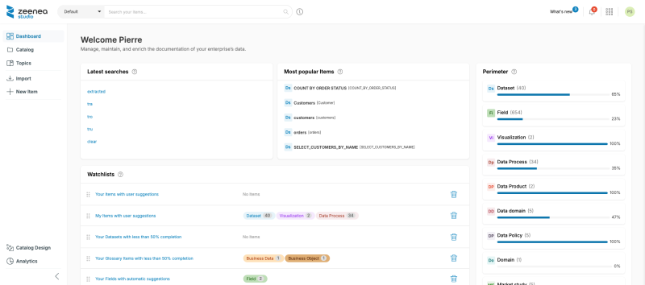
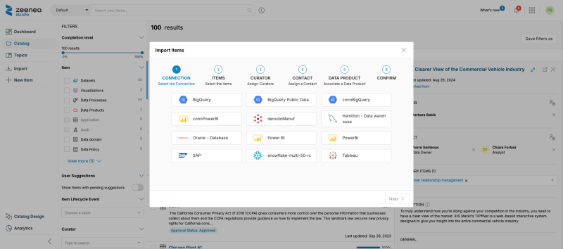
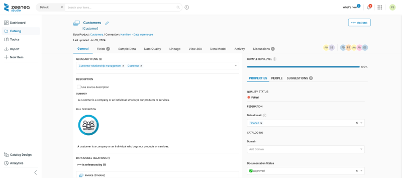

<!-- #p100003 -->
# As a Data Steward

<!-- #p100009 -->
As a Data Steward of the Zeenea suite, you have specific rights and permissions. 

<!-- #p100015 -->
Data stewards are responsible for documenting and managing the catalog items assigned to them.

<!-- #p100021 -->
## Requirements

<!-- #p100027 -->
Before starting in Zeenea as a Data Steward, a few requirements must be met:

- <!-- #p100033 -->
  Your user account must be associated with a group of type "Data Steward"

- <!-- #p100042 -->
  At least one scanner must be installed and connected to your catalog (see our article about Scanners)

- <!-- #p100051 -->
  The metamodels of your items must be defined (see our article Configure a metamodel (template))

- <!-- #p100060 -->
  Responsibilities to be assigned to contacts in the catalog must be defined (see our article Create, edit or delete responsibilities)

- <!-- #p100069 -->
  An inventory of the connection(s) for which you are responsible as Data Steward must have been made by an administrator (see our article Create, manage or delete a connection)

- <!-- #p100078 -->
  Once these conditions have been met, you can proceed with the steps below.

<!-- #p100090 -->
### Step 1: Log in to your Dashboard

<!-- #p100096 -->
The dashboard is the home page of the Data Steward's Zeenea Studio application. 

<!-- #p100102 -->
Once logged in, you will find on this page the main management indicators of your perimeter.

<!-- #p100108 -->
It is therefore your main entry point to access the datasets for which you are responsible as Data Steward.

<!-- #p100120 -->

<!-- #p100126 -->
### Browse the catalog items

1. <!-- #p100135 -->
   Log in to the **Catalog** section of the left menu to explore the items already imported 

2. <!-- #p100144 -->
   Discover the connections and items already in place between your information system and the catalog.

<!-- #p100156 -->
## Step 2: Import items from a connection

<!-- #p100162 -->
If you are responsible for curation and import on one or more connections, start selecting the items you want to document first using our import path.

<!-- #p100174 -->

<!-- #p100180 -->
For more details on importing items into the catalog, read Importing "Datasets" or "Visualization" items into Zeenea

<!-- #p100186 -->
## Step 3: Select the items for which you are responsible

<!-- #p100192 -->
Before you start documenting items, they must be assigned to you as a Contact with the appropriate responsibility, depending on your organization.

- <!-- #p100198 -->
  If datasets have been assigned to you: a link allows you to access them directly from your dashboard.

- <!-- #p100207 -->
  If no item has been assigned to you yet: log in to the "Catalog" section and use the filters to find the desired items.

<!-- #p100219 -->
Then you should be able to try the following features:

- <!-- #p100225 -->
  Adding contact item by item or in bulk (read more here).

- <!-- #p100234 -->
  Search and filters (read more here).

- <!-- #p100243 -->
  Bulk edition (read more here).

<!-- #p100255 -->
## Step 4: Start documenting your perimeter

<!-- #p100261 -->
Once your perimeter is defined, you can start its documentation.

<!-- #p100267 -->
For more details on item documentation, see Understanding the Documentation of an Item.

<!-- #p100279 -->

