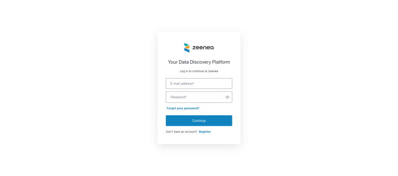
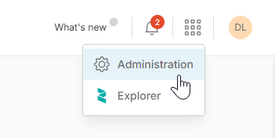
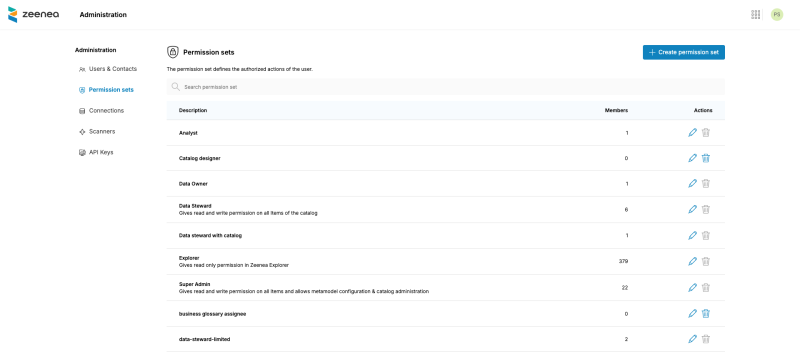
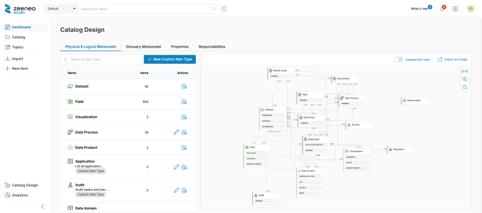

<!-- #p100003 -->
# As a Super Admin

<!-- #p100009 -->
The role of Super Admin is frequently shared or supported by several collaborators to cover the technical and functional skills required.

<!-- #p100015 -->
Should you require more technical information or advice on the installation phase, please refer to the technical file.

<!-- #p100021 -->
You have specific rights and permissions as a Super Admin of the Zeenea suite. 

<!-- #p100027 -->
## Step 1: Log in to Zeenea

<!-- #p100033 -->
You enter the login/password combination which will have been sent to you by email.

<!-- #p100039 -->
:::note If you are logging in for the first time on a version without specific configuration, the default user IDs for this profile are: zeenea/zeenea :::

<!-- #p100051 -->

<!-- #p100057 -->
## Step 2: Configure the Zeenea platform

<!-- #p100063 -->
Platform configuration is the main action reserved for Super Admin. 

<!-- #p100072 -->
It can be accessed by clicking **Administration** in the top menu.

<!-- #p100084 -->

<!-- #p100090 -->
From this interface, you will be able to supervise the platform regarding the following elements: 

<!-- #p100102 -->

- <!-- #p100108 -->
  Users

- <!-- #p100117 -->
  Groups

- <!-- #p100126 -->
  Catalogs

- <!-- #p100135 -->
  Connections

- <!-- #p100144 -->
  Scanners

- <!-- #p100153 -->
  API keys

<!-- #p100165 -->
## Define the data catalog metamodel

<!-- #p100171 -->
As Super Admin you can also configure the documentation in Zeenea. 

<!-- #p100177 -->
This section is accessible from Zeenea Studio via the "Catalog Design" button in the left menu.

<!-- #p100189 -->

<!-- #p100195 -->
Defining a metamodel is an important step to enable authorized persons to fill in the documentation in the catalog in a targeted and therefore efficient manner.

<!-- #p100201 -->
The design of the metamodel is divided into two parts: the physical and logical layer and the semantic layer (or glossary).

<!-- #p100207 -->
### Define the metamodel of the physical and logical layer

<!-- #p100213 -->
The physical and logical layer of the catalog corresponds to all the technical assets of your IS (datasets, visualizations, etc.), the technical processes for transforming the data. Its purpose is also to represent your organization around the data (consumers, producers, business processes, etc.).

<!-- #p100219 -->
Refer to the following links for more details:

- <!-- #p100240 -->
  Read more: Configuring templates NOTE: This link is broken in Salesforce docs.

- <!-- #p100249 -->
  Read more: Creating or Deleting a Custom Item Type

- <!-- #p100258 -->
  Read more: Adding Input and Output Types to Data Processes

<!-- #p100270 -->
### Define the metamodel of your Glossary

<!-- #p100276 -->
The glossary is used to represent all the business concepts of your company (business terms, indicators, etc.) and allows you to build a common language for better collaboration around the data.

<!-- #p100282 -->
Here you can create the item types you want, define their templates and create relationships between glossary item types or with physical layer item types.

<!-- #p100288 -->
Read more: Configuring the Glossary Metamodel

<!-- #p100294 -->
## Define responsibilities

<!-- #p100300 -->
In Zeenea, a responsibility describes the nature of the relationship between an individual or an entity and an item of the catalog. This attribute thus allows any user to identify the relevant contact person for their needs from the detailed page of the item once it has been completed (Data Steward, Data Owner, etc.).

<!-- #p100306 -->
Read more: Creating, Editing, or Deleting Responsibilities

<!-- #p100312 -->
## Step 4: Start importing and documenting your items

<!-- #p100318 -->
Congrats! You have laid the foundations of the catalog. Carry on the journey As a Data Steward.

