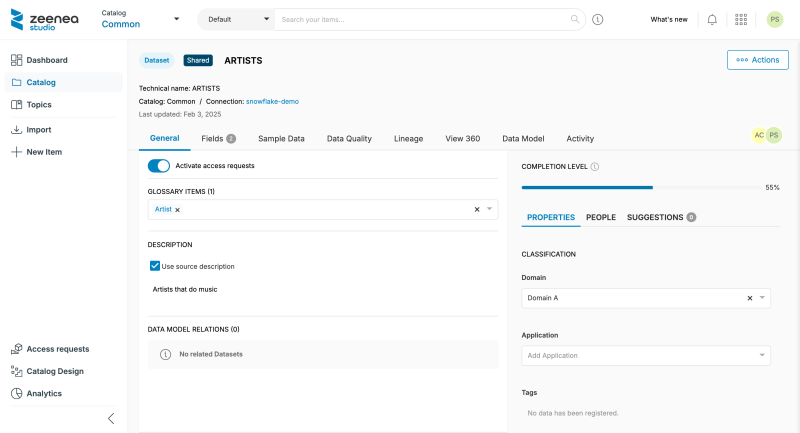

<!-- #p100003 -->
# Access Requests

<!-- #p100009 -->
Zeenea Data Discovery Platform provides an Access Request feature, designed to simplify and streamline processing the access requests to data assets and products across your organization.

<!-- #p100015 -->
With just a few clicks, users can submit a request for access to data assets or data products they need, directly through the Explorer. Data owners can then review these requests in the Studio and trigger the creation of a ticket in an external workflow management tool to apply the appropriate permissions. 

<!-- #p100021 -->
## Key Benefits

- <!-- #p100027 -->
  Frictionless access: End-users can easily request access to any dataset within the catalog without navigating complex processes between several tools.

- <!-- #p100036 -->
  Approval workflow: Requests are automatically routed to the appropriate data owner or administrator for review and approval in the Studio, ensuring security and compliance are upheld.

- <!-- #p100045 -->
  Audit trail: Every request and access change is tracked, providing full visibility and traceability of data access across the organization.

- <!-- #p100054 -->
  Empowered teams: Enabling self-service access requests allows your teams to unlock data faster and keep momentum moving without unnecessary delays.

<!-- #p100066 -->
This feature is key to fostering a more collaborative and data-driven culture while maintaining strong governance and security controls.

<!-- #p100072 -->
## Principles

<!-- #p100078 -->
The scheme below describes how access requests are handled in Zeenea:

1. <!-- #p100084 -->
   A Data consumer writes a request in Zeenea Explorer from the details page of an item.

2. <!-- #p100093 -->
   An email notification is automatically sent to the owner of the item for review.

3. <!-- #p100102 -->
   The owner reviews the request in Zeenea Studio and approves or declines it.

4. <!-- #p100111 -->
   Once reviewed, an email notification is automatically sent to the sender with the status of their request.

5. <!-- #p100120 -->
   If approved, a machine-readable email is sent to the external workflow system to create a ticket and configure the permissions.

<!-- #p100138 -->


<!-- #p100144 -->
## Enabling Access Requests

<!-- #p100150 -->
Access requests are disabled by default on your tenant. Go to the "Access requests" section in the Administration interface to enable the feature.

<!-- #p100156 -->
In this section, you select the item types for which you want to enable the feature: Datasets, Visualizations, and soon Output ports of Data products.

<!-- #p100162 -->
For each type, select or fill in the following parameters:

- <!-- #p100168 -->
  Allow access requests: Allow Curators to activate data access requests on their items

- <!-- #p100177 -->
  External authorization workflow: Trigger a call to an external workflow system once the request is approved in Zeenea Studio

- <!-- #p100186 -->
  Channel: Protocol used to call the external workflow system (only email is available for now)

- <!-- #p100195 -->
  Recipient: Email address of the external workflow system to process data access requests

<!-- #p100210 -->
In the case of the Federated Catalog, access requests are handled at the tenant and catalog levels. By default, all catalogs use the tenant configuration. But you can define a local configuration by toggling off the **Use global configuration** button.

<!-- #p100222 -->


<!-- #p100228 -->
So far, access requests are enabled but not activated on any item yet.  

<!-- #p100234 -->
## Activating Access Requests on an Item

<!-- #p100240 -->
When access requests are enabled for an item type, you can activate the feature from an item details page by toggling the "Activate data access requests" button. You must have write permissions on the item to activate data access requests.

<!-- #p100246 -->
You can also deactivate the feature instantly by toggling the button again.

<!-- #p100252 -->
Note that at least one contact must have access to the Studio to make the feature available in the Explorer. This ensures at least one person can review the access requests.

<!-- #p100264 -->


<!-- #p100270 -->
## Submitting an Access Requests on an Item

<!-- #p100276 -->
When the feature is activated for an item, you can request access from its details page by clicking the "Request access" button on the top right.

<!-- #p100288 -->


<!-- #p100294 -->
## Access Request Form

<!-- #p100300 -->
You must provide the following information to submit your request:

- <!-- #p100306 -->
  Purpose: The reason or project why you need to access the data

- <!-- #p100315 -->
  Audience: For whom you are requesting access (Individual or Service account)

- <!-- #p100324 -->
  Approver: Select the person to which sending your request

<!-- #p100336 -->
Once submitted, the approver receives an email notification to invite them to review it. As soon as your request is reviewed, you also receive an email notification with the status of your request (approved or declined) and an optional comment from the approver.

<!-- #p100342 -->
## Managing Your Pending Access Requests

<!-- #p100348 -->
### Listing your pending data access requests

<!-- #p100354 -->
You can retrieve the list of your pending data access requests by clicking the "Access requests" link on the right of the Zeenea Explorer header.

<!-- #p100366 -->


<!-- #p100372 -->
### Canceling a Data Access Request

<!-- #p100381 -->
From the access request list, click the **Cancel** button to delete your request. When canceled, the request also disappears from the list of pending requests for the approver.

<!-- #p100387 -->
## Reviewing Access Requests

<!-- #p100393 -->
You can manage the access requests assigned to you from the "Access requests" section in the Studio.

<!-- #p100405 -->


<!-- #p100411 -->
From this screen, you can directly approve or decline a request. In both cases, you can add a comment to the request.

<!-- #p100417 -->
You can also reassign the request to another person among other possible approvers for this item. When reassigning a request, the new approver receives an email notification.

<!-- #p100423 -->
## Authorizing Access Requests

<!-- #p100429 -->
If you have activated the "External authorization workflow" option in the Administration, an email is automatically sent to the specified address once a request is approved in Zeenea Studio.

<!-- #p100435 -->
This email is formatted in XML so that it can be automatically parsed by a ticketing or workflow management tool like Jira or ServiceNow. Below is an example of an authorization request email:

<!-- #p100444 -->
**Object**: \[Zeenea\] Data Access Request on Item ABCD

<!-- #p100453 -->
**Content**:

<!-- #p100459 -->
```
<?xml version="1.0" encoding="UTF-8"?>
<dataAccessRequest>
<requester>johndoe@acme.com</requester>
<approver>janesmith@acme.com</approver>
<subject>
  <subjectId>8ddb77f2-8deb-4e92-84e1-fc1d76e6ee92</subjectId>
  <subjectName>ARTISTS</subjectName>
  <subjectUrl>https://acme.zeenea.app/studio/permalink?uuid=8ddb77f2-8deb-4e92-84e1-fc1d76e6ee92&nature=dataset</subjectUrl>;
</subject>
<audience>Individual</audience>
<purpose><![CDATA[Monthly report]]></purpose>
</dataAccessRequest>
```

<!-- #p100465 -->
By configuring your workflow management tool to parse this email, you can automatically extract the relevant information and create a ticket to apply the right permissions to the user.

<!-- #p100471 -->
This email contains the following information:

- <!-- #p100480 -->
  **requester**: The email address of the person requesting access

- <!-- #p100492 -->
  **authorizer**: The email address of the person who approved the request

- <!-- #p100504 -->
  **subjected**: The Item's unique identifier in Zeenea (UUID)

- <!-- #p100516 -->
  **subjectName**: The Item name

- <!-- #p100528 -->
  **subjectUrl**: The URL of the Item to show in Zeenea

- <!-- #p100540 -->
  **audience**: Whereas the access is requested for an individual or a service account

- <!-- #p100552 -->
  **purpose**: The purpose of the request (free text)

<!-- #p100564 -->
## Auditing Access Requests

<!-- #p100570 -->
### Auditing Access Request Configuration Changes

<!-- #p100576 -->
The configuration changes regarding data access requests are traced in the audit log. You can list audit events using the Audit API.

<!-- #p100582 -->
### Auditing Access Request Changes

<!-- #p100588 -->
The data access requests and their processing are recorded in the audit log. You can list audit events using the Audit API.

