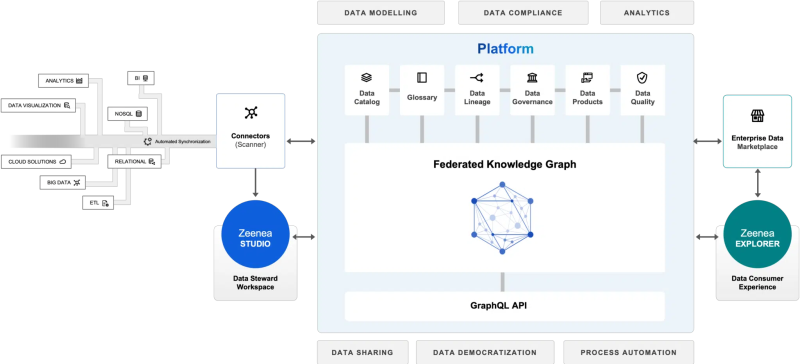
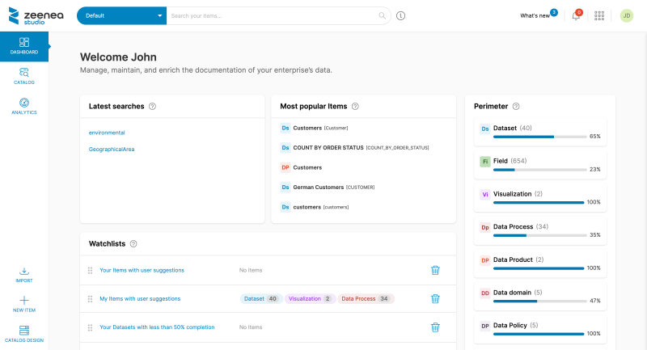
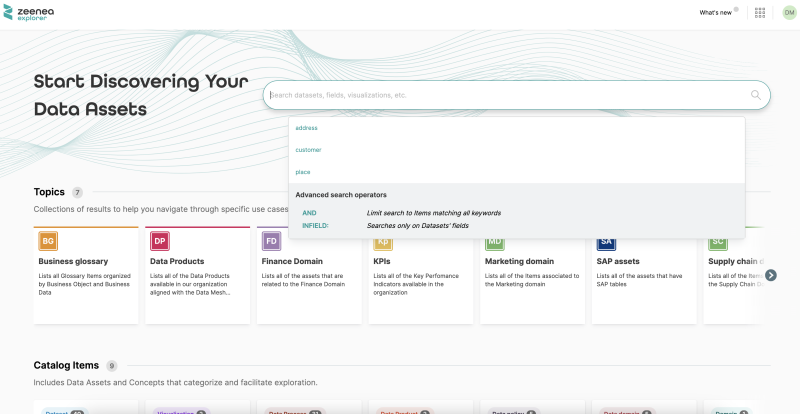

<!-- #p100003 -->
# Zeenea Data Discovery Platform

<!-- #p100009 -->
Actian Zeenea provides an intelligent data discovery platform.

<!-- #p100015 -->
This solution enables metadata management for search, exploration, data governance, compliance, and cloud transformation initiatives.

<!-- #p100027 -->

<!-- #p100033 -->
### Universal connectivity

<!-- #p100039 -->
Actian Zeenea connects to all your data sources in seconds.

<!-- #p100045 -->
Our platform’s built-in scanners and APIs enable organizations to automatically collect, consolidate, and link metadata from their data ecosystem. Our connectivity includes a wide variety of data sources such as the Cloud, ERP/CRM, NoSQL, Processing, Relational, Visualization, and more.

<!-- #p100051 -->
### Cloud-native design

<!-- #p100057 -->
Our data discovery platform is cloud-native and developed as-a-Service (SaaS) to help enterprises reduce risks, optimize costs, and simplify data access across the organization. Our architecture makes it easy for you to deploy a variety of environments in the cloud – hybrid, inter-cloud, or multi-cloud.

<!-- #p100063 -->
### Powered by knowledge graph technologies

<!-- #p100069 -->
Our platform is powered by enhanced knowledge graph capabilities, providing rich and in-depth search results, optimized data discovery, and intelligent recommendations. Through machine learning algorithms, it provides structure for all your data and enables the creation of multilateral relations between your data assets.

<!-- #p100075 -->
### A safe &amp; secure platform

<!-- #p100081 -->
Keeping our customers’ data safe and secure has always been a top priority at Actian Zeenea, this is why we are SOC 2 Type II and ISO 27001 compliant. This demonstrates our ongoing commitment to maintaining the highest data security standards.

<!-- #p100087 -->
## Platform Capabilities

<!-- #p100093 -->
### Flexible metamodel

<!-- #p100099 -->
Via powerful knowledge graph technology, add, configure, and overlay documentation properties on your data through a flexible metamodel template. Simply drag &amp; drop your properties, tags, and other metadata into your documentation templates and use our dynamic diagram to visualize your metamodels and their relations with other catalog objects, including domains, data products, custom assets, and more.

<!-- #p100105 -->
### Automated Data Stewardship

<!-- #p100111 -->
Zeenea Data Discovery Platform provides a connected and automated metadata management solution that enables Data Stewards to overcome the challenges associated with handling increasingly large volumes of data.

<!-- #p100117 -->
Our platform helps organizations maximize the value of their data by reducing the time spent on complex and time-consuming documentation tasks, and by breaking data silos to increase enterprise data knowledge.

<!-- #p100123 -->
### Smart Data Discovery

<!-- #p100129 -->
Strongly inspired by marketplaces and e-commerce websites, Zeenea offers smart searching capabilities for data consumers to quickly find the relevant data for their business use cases.

<!-- #p100135 -->
Our Data Discovery Platform provides a multi-dimensional search engine, able to retrieve the right information whether you know what you are looking for (high intent) or not (low intent).

<!-- #p100141 -->
### Business Glossary

<!-- #p100147 -->
Zeenea’s Business Glossary features enable the creation and sharing of a consistent business language across all data consumers within the organization. Through an easy-to-use interface that is supported by automation capabilities, data Management teams can:

- <!-- #p100153 -->
  Define rules, policies, and KPIs

- <!-- #p100162 -->
  Design reliable glossary models

- <!-- #p100171 -->
  Get suggestions for business terms

- <!-- #p100180 -->
  View the relations between glossary items

<!-- #p100192 -->
### Data lineage

<!-- #p100198 -->
Zeenea’s Data Lineage capabilities enable data teams to get a complete view of their data’s lifecycle – from its collection to its use, storage, and preservation over time. Automatically map the relationships between systems, applications, and reports to provide a context-rich data ecosystem for your organization.

<!-- #p100204 -->
Through an interactive and user-friendly lineage graph, better understand your data, easily identify transformations, and ensure regulatory compliance.

<!-- #p100210 -->
### Data quality

<!-- #p100216 -->
Zeenea automatically synchronizes with your data quality solutions, enabling your users to view their datasets’ quality metrics from the discovery phase of their data use cases.

<!-- #p100222 -->
Our platform helps organizations make better business decisions by enabling data users to quickly detect and take action on a dataset’s quality to uncover its trustworthiness before an issue arises.

<!-- #p100228 -->
## Use cases

<!-- #p100234 -->
### Data catalog

<!-- #p100240 -->
Zeenea Data Platform enables Data Managers and Data Producers to master the organization's data landscape by providing advanced back-office capabilities:

- <!-- #p100246 -->
  Information modelling (metadata model)

- <!-- #p100255 -->
  Automation, suggestions, productivity

- <!-- #p100264 -->
  Data Stewardship workflows

- <!-- #p100273 -->
  Expert system

<!-- #p100285 -->
Zeenea’s federated graph-powered EDM enables organizations to mirror the Data Mesh at the metadata level and build a global, scalable, supervision plane that is perfectly integrated with data production and consumption processes.

<!-- #p100291 -->
### Enterprise Data Marketplace

<!-- #p100297 -->
The Enterprise Data Marketplace (EDM) is an e-commerce-like solution, where Data Producers publish their products and Data Consumers explore, understand, and acquire these published products.

<!-- #p100303 -->
The Marketplace sits on top of the Data Catalog to share and exchange the most valuable Domain Data packaged as Data Products.

<!-- #p100309 -->
## One platform, two dedicated apps

<!-- #p100315 -->
Inspired from e-commerce or CMS platforms, Zeenea offers dedicated applications and UX depending on the user personas.

<!-- #p100321 -->
### Zeenea Studio

<!-- #p100327 -->
Zeenea Studio is the application that enables data management teams to manage, maintain, and enrich the documentation of their company’s data assets.

<!-- #p100333 -->
It is the back-office tool of the platform.

<!-- #p100345 -->

<!-- #p100351 -->
### Zeenea Explorer

<!-- #p100357 -->
With Zeenea Explorer, your business users have access to a user-friendly interface and customized exploration paths to make their data discovery more efficient.

<!-- #p100363 -->
Drawing inspiration from e-commerce websites, it offers very simple ergonomics based on research ans of data and collaboration around their uses.

<!-- #p100375 -->

