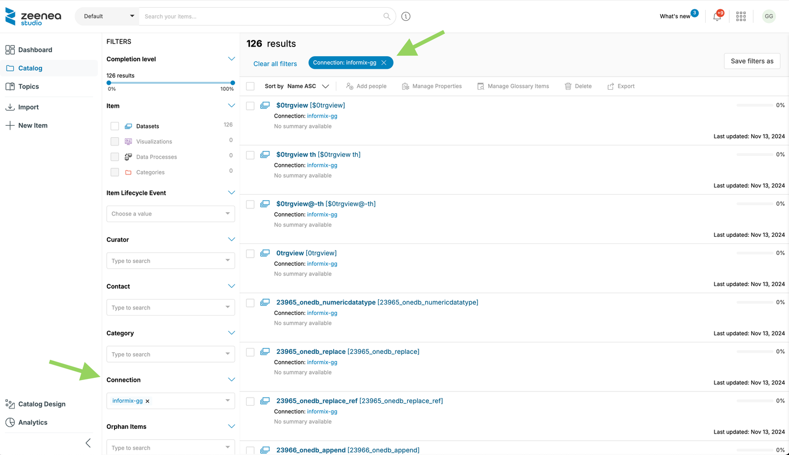
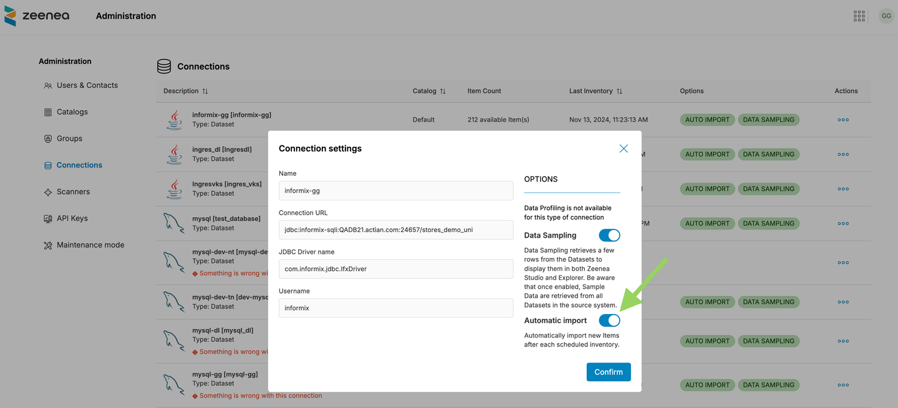

# Adding an Actian Informix Connection

## Prerequisites

* The current Scanner version requires Java 11. Either OpenJDK or Oracle JDK can be installed.
* It is assumed that the Zeenea Scanner has been successfully downloaded and configured. See [Zeenea Scanner Setup](../Scanners/zeenea-scanner-setup.md).

## Installing the Generic JDBC Connector Plugin

1. Download the Generic JDBC connector plugin from the Zeenea connectors download links page, or download directly at [https://plugins.zeenea.app/jdbc-connector-plugin/jdbc-connector-plugin-74.zip](https://plugins.zeenea.app/jdbc-connector-plugin/jdbc-connector-plugin-74.zip).
2. Move the zip file to the `[scanner_install_dir]/plugins` folder. **Do not unzip the archive**.

## Installing the Informix Driver

1. Download an Informix driver for your connector. You can find a driver here: [Actian ESD](https://esd.actian.com/) or https://mvnrepository.com/artifact/com.ibm.informix/jdbc. 
3. Extract the jar file, if needed, and copy it to the `[scanner_install_dir]/lib-ext` folder:

     `jdbc-4.10.16.jar` (Version may differ)

## Creating the Configuration File

1. In the `[scanner_install_dir]/connections` folder, create a new file named `informix.conf`. (The file can be named as desired, but the file extension must be `.conf`.)
2. Copy and modify the content below based on your environment configuration, replacing `<HOSTNAME>`,`<PORT>`, `<DATABASE>`, `<USER>` and `<PASSWORD>` with the appropriate values for your environment.

     ```
     # Unique code and name for this connector.
     # NOTE: code must be unique across all scanners in your organization.
     code = "actian-informix_connector_code"
     name = "actian-informix_connector_name"

     # Connector ID (do not change)
     connector_id = "generic-jdbc"
     enabled = true
     
     connection {
          # JDBC URL to connect to the Informix database
          url = "jdbc:informix-sqli:<HOSTNAME>:<PORT>/<DATABASE>"
          # Driver name (do not change)
          jdbc_driver_name = "com.informix.jdbc.IfxDriver"
          # Authentication details (modify as per environment)
          # Default password is an empty string
          username = "<USER>"
          password = "<PASSWORD>"
     }
     ```

## Verifying the Connection​

1. Restart Zeenea Scanner.
2. In Zeenea Administration, click Connections and verify that the new connection is listed:


3. If you encounter any issues, review the scanner.log file located in the `[scanner_install_dir]/logs` folder for troubleshooting guidance. Also refer to [Troubleshooting for Scanners and Connections](../Scanners/zeenea-troubleshooting.md).

## Viewing the Dataset​

1. Switch to Zeenea Studio by clicking the apps icon in the upper right and selecting Studio:



## Configuring the Connection for Automatic Import​

If desired, you can configure a connection to automatically import data as follows:

1. In Zeenea Administration, open the Connections page, then click the ellipsis button in the Actions column for your connection:


2. Toggle Automatic import on:


