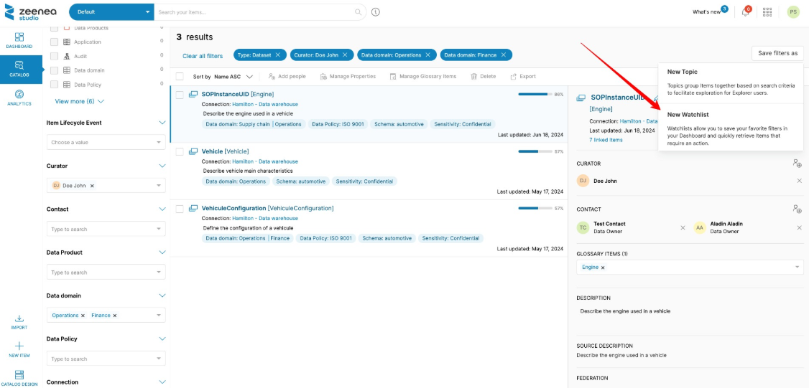
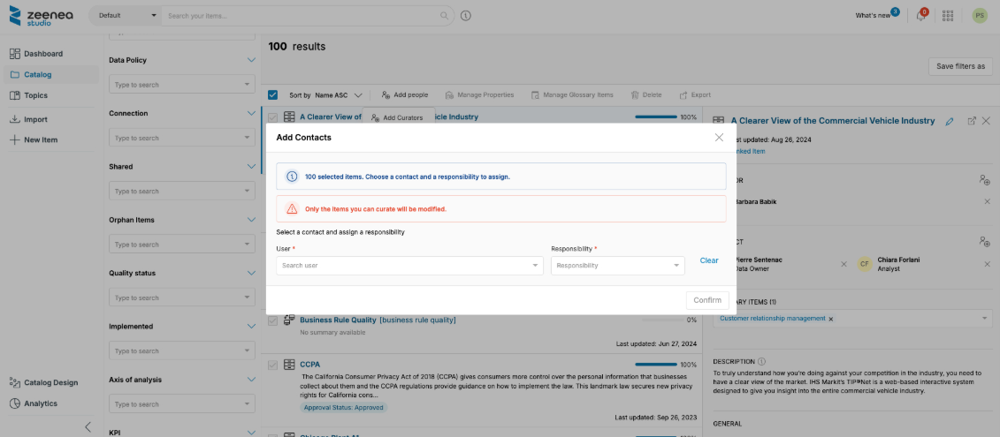
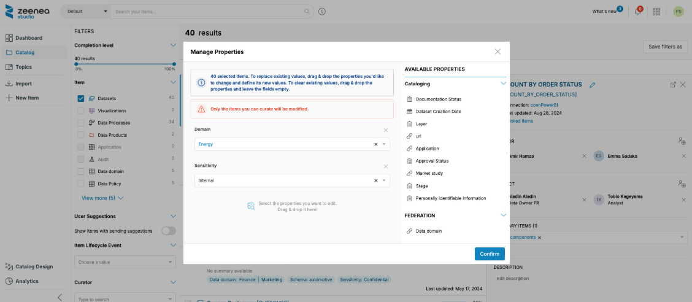
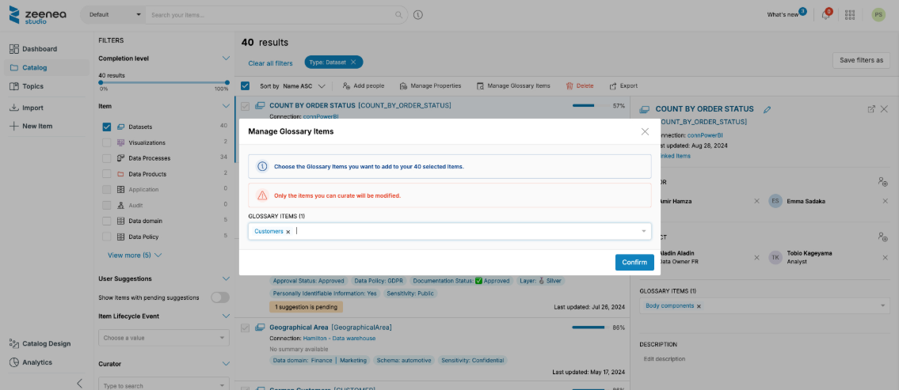
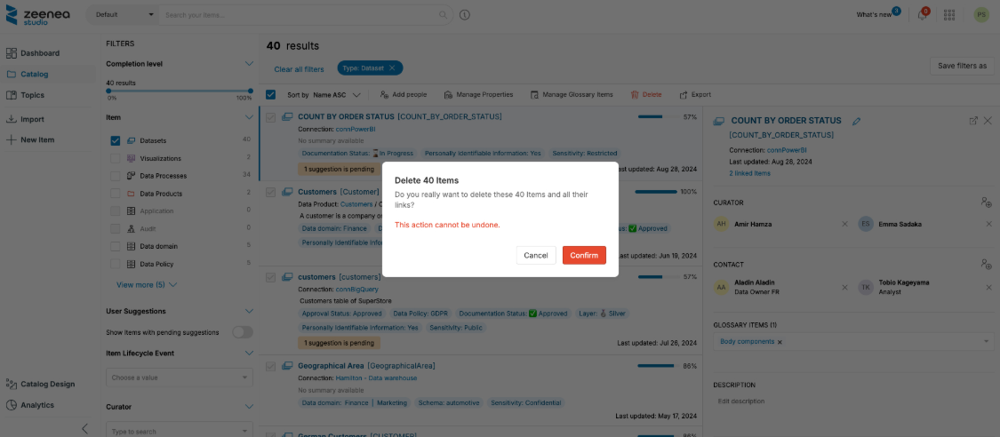

# Editing Items in Bulk

## Editing Item Documentation

The bulk edition is available in the Catalog section by clicking the **Edit** button.

Bulk edition actions include:

* Adding contacts
* Adding curators
* Managing properties
* Managing glossary Items

Bulk publishing can be done on: 

* a selection of items via the checkboxes in the search results
* all the results of a search by using the checkbox in the column header

    

> **Note:** The update is performed asynchronously. You may need to refresh the page to see changes made to the selected items.

## Adding Contacts

This feature is enabled if the following conditions are met:

* There is at least one Responsibility defined in Zeenea
* At least one item is selected

1. Click the **Add People** button, then click the **Add Contacts** button.
2. Search for a contact already referenced in Zeenea.
3. Select from the list a responsibility that will be associated with it.
4. Click **Confirm** to close the window and update the selected items.

    

> **Note:** An item can be assigned several times to the same contact with different responsibilities. In the same way, several contacts may share a responsibility.

## Adding Curators

This feature is enabled if the following condition is met:

* At least one item is selected

Click on the "Add People" button, then the "Add Contacts" button : 

1. Search for a user already existing in Zeenea.
2. Click **Confirm** to close the window and update the selected items.

    

## Managing Properties

This feature is enabled if the following conditions are met:

* Only one type of item is selected.
* At least one item is selected.

1. Click **Manage Properties**.
2. Select the properties to be integrated in the selected items from right to left via drag and drop.
3. Click the "Confirm" button to close the window and start the update.
4. Once one por more properties are submitted, the values can be filled in in the same way as on the detailed page of an item.

> **Important:** The property bulk editing feature works in "undo and replace" mode. The values previously filled in on the selected items will therefore be overwritten.

Leave a property empty to reset the value of this field for the selected items.

  

## Managing Glossary Items

This feature is enabled if the following conditions are met:

* Only one type of item is selected
* At least one item is selected
* At least one Glossary Item exists
* The selected Item Type supports links with at least one Glossary Type

1. Click **Manage Glossary Items** button.
2. Choose a Glossary Item among those already registered.
3. Repeat the operation if necessary, to add several Glossary Items at once.
4. Click **Confirm** to close the window and update the selected items.

The Glossary Items management feature merges the selected values with those already present on the items. Thus, a value already existing will be kept without creating a duplicate, while missing values will be added.

It is not possible to delete values using this feature.

  

## Deleting items

This feature is enabled if the following conditions are met:

* At least one item is selected.
* The selection does not contain any items of the Field or Category type.
* The selection does not contain any implemented Glossary Item.
* The selection does not contain any implemented Custom items.

Click the **Delete** button to open the window below.

Click **Yes** to close the window and start the final deletion of the selected items.

  

## Sharing Items

When the Federated Catalog is activated, you can manage the sharing status of your objects by clicking on the **Share** button and selecting one of the following options:

* Share items
* Unshare items

## Moving items

When the Federated Catalog is activated, you can move objects in bulk to another catalog by clicking the **Move to catalog** button.

This action is only available from the default catalog.