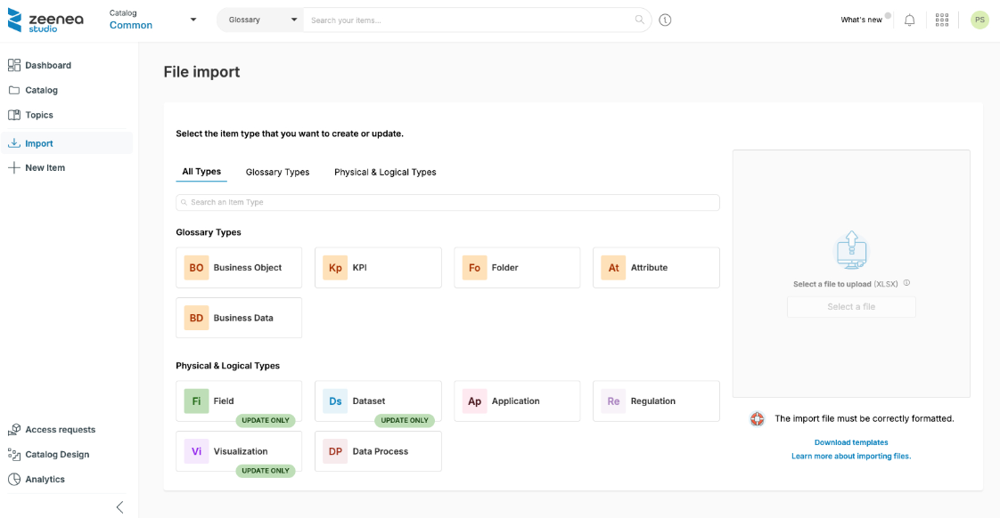
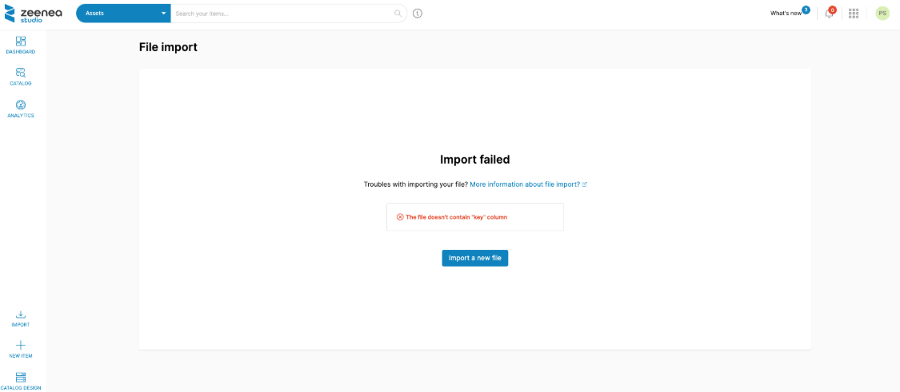

# Importing a File in Zeenea

The Zeenea File Import feature allows you to bulk-create and update items in the catalog. This feature supports Excel (.xlsx) files.

Once you've gathered and formatted the data you wish to add/update, click **Import** and then select a file in the Studio: 

   

## Prerequisites

The import file must meet the following criteria: 

* The format must be .xlsx
* The data you wish to import must be located in the first tab of your Excel file
* The file size must be less than 50 Mb
* The file can only contain one type of Item, selected directly from the import menu on the Studio. You may import documentation about any type of Item in Zeenea.
* The import file must have a header: 
  * The file must contain one column per attribute (property, responsibility, etc.) that you want to modify. Columns that can not be mapped with an attribute of the Item Type metamodel will be ignored during import.
  * The import file must contain a column named "key" to identify the imported Items. For more information on Unique Keys and how they can be used, please refer to this article. 
* The import file can also have the following attributes, depending on the type of Item being imported:  
  * name: The name of the Item.
  * description: The description of the Item.
  * summary: The summary of the item description.
  * contacts: For each responsibility, a column with its name will be added to the template. Please note that Curators can imported using the "curator" column. 
  * Template properties: for each property, a column will be added to the template. 
  * Links with Custom Items or Glossary Items: for each type of Item that can be associated, a column will be added to the template. 
  * Inputs & Outputs (Only for Data Processes): These columns can be used to import/update a lineage, and may only contain Dataset unique keys or Custom Item unique keys (depending on your metamodel configuration). 
  * Calculation of the Data Profiling (Fields only)
  * Publishing of the Data Profiling (Fields only)

In the case of the Federated Catalog, you can also import the following attributes:
* Sharing status: Whether the Item is shared or not with other catalogs
* Catalog code: The code of the catalog the Item belongs to

File import templates are available by clicking **Download Template**. These templates are dynamically generated and contain only properties relevant to your metamodel. 

You can delete any columns from the template if you do not wish to update their related property.  

During the import, Zeenea will map each column to a property. If even one column cannot be mapped to an existing property, the entire file will be discarded and the following screen will be displayed: 

   

If the above conditions are fulfilled, a summary will be displayed allowing you to check the columns of the file that will be mapped or ignored. Click on "Import" to apply modifications.

Please also note the following constraints: 

* If no key was specified during an import, a key will automatically be generated upon the creation of that Item. If an Item with the same name already exists for this type, an error will occur and the Item will not be created.
* If a key was specified during the import, but it couldn't be found in the catalog, the import will fail if the Item is linked to a connection. Otherwise, the Item will be created with the specified key.
* If an object is linked to multiple other items, each one of those will need to be separated by a ";" symbol. 
* If the same Excel file is imported multiple times, duplicates may be created. 
* For Glossary Items, the file contains a "Parent" column as defined in that Glossary Item's metamodel. It is, however, not yet possible to link "Children" objects to that Glossary Item.  
* The Excel Import feature can't be used to delete property values. In case a column has been left empty on the Excel file, it will have no impact on the contents of that property in the Catalog. 
* Regarding multivalued properties, the Excel Import feature allows only for new values to be added (previous property values will remain in the Catalog).
* Regarding single-valued properties, any value imported via an Excel file will override the content of said property in the Catalog. 

## Other Notes

### Duplicated Entries in the File

If the file contains several lines for the same item, Zeenea will treat them sequentially. 

### Duplicated Columns in the File

If the file contains duplicated columns, the entire file will be discarded. 

### Unmapped Columns

The columns in the file must be mapped to existing attributes of the target Item Type. Unmapped columns will be ignored.

### Multi-Valued Properties

Each value must be separated by a semicolon in the same column.

Multi-valued properties in the file will be merged with the existing ones in the catalog. 

### Special Characters and Formulas

Zeenea does not check for special characters. Files containing formulas will thus be treated.

## Specific Attributes

### Name

By adding a value to the “name” column in the import file, you can set or update the functional name of a Dataset or of a Field, in which case the import works as follows: 

* If the “name” column exists in the file but is empty, then it is ignored.

* If the “name” column exists in the file, is not empty, and its value is the same as the one in the “source name” column, then the functional name of the Dataset or Field in Zeenea becomes the same as the Source Name (if the source name changes, the functional name will be updated as well). 

* If the “name” column exists in the file, is not empty, and its value is different from the “source name”, then the functional name of the Dataset of Field in Zeenea is updated with the new value. Then, if the source name is updated, the functional name will remain the same. 

### Description

To import or update an object's description, the header line must include a "description" column, and a "description type" column.

The description type column can take the following values: RICH or SIMPLE.

Descriptions are imported in "raw text" mode only (with no formatting apart from line breaks):

* If the value of the "description type" column is SIMPLE, the description specified in the Excel file will update the existing description.
* If the value of the "description type" column is RICH, the description specified in the Excel file will be ignored.

It is, therefore, possible to change a rich description back to a simple description by changing the value of the "description type" column. In this case, any HTML tags in the description will be transcribed as raw text in the applications.

> **Note:** Only the Zeenea description can be added/updated. The source description collected by the connector can't be edited.

### Summary

To import or update an item's summary, the header line must include a "summary" column, and a "description type" column.

If the description type value is "RICH", the summary will be updated. Otherwise, the cell will be ignored.

### Properties

You may update values for the following properties: 

* Short text
* Rich text
* Number
* Select
* Multi-Select
* URL

For each one of these values, the header must contain the name of the target property as a column. 

> **Note:** 
> * Only properties defined in Zeenea can be set/updated. Properties harvested through a connector are ignored.
> * For URL-type properties, you can set or update its label by using the following format in the cell: `https://www.mycustomurl.com[label]`

### "Relationship"-Type Properties

You may use the import file to add/update relations with custom objects. 

For each property, the header must contain its name as a column, as well as the name of each custom object you wish to add a link.

### Responsibilities

You may add in the header as many columns as there are existing responsibilities (i.e. "Data Owner", "Data Steward", etc...). 

For each responsibility, contacts must be identified using their email address, as specified in Zeenea. 

If you wish to add multiple contacts for one responsibility, you will have to separate them using a semicolon. 

If the user that performs the import does not have permission to edit unassigned items, he will be automatically added as curator to the newly imported items.

### Glossary Items

The Import file must contain a column for each type of Glossary Item.

For each Glossary Item you wish to link to another object, you will need to specify its key.  

If you wish to add multiple Glossary Items for a single object, you will have to separate them using a semicolon. 

### Data Profiling

When updating Fields, you may also update the data profiling attributes for each one of them (if the data profiling option is enabled at the connection level). 

The “fingerprinting” column may take one of the following values: 

* true (activate the calculation of the profiling)
* false (disable the calculation of the profiling)

You may also publish the Data Profiling in the Explorer. To do so, you will have to select one of the following options in the “data profiling” column: 

* true (show data profiling in the Explorer)
* false (hide data profiling in the Explorer)

### Catalog

In the case of the Federated Catalog, change the value of the column "catalog code" to move an Item from one catalog to another.

### Shared

In the case of the Federated Catalog, you can manage the sharing status of an Item by filling in the column "shared": 

* true (share the Item)
* false (disable the sharing)

### Error Management

Zeenea reads the file in a sequential manner (line by line) and, for each line, attempts to take care of as many attributes as possible. 

Once the import has finished, you will be presented with a summary: 

* X imported items: number of items that were successfully added to the catalog and for which all specified attributes were imported
* X updated items: number of items in the catalog that were successfully updated and for which all specified attributes were imported. 
* X lines in error: number of lines in the file for which at least one attribute was in error. 

In case of errors, you will be able to download a .xlsx file detailing where those errors were found in the original import file.

Cells containing the error(s) will be shown in orange and a detailed explanation of each error is added as a comment. 

You can correct those cells and import the downloaded file in Zeenea again. 