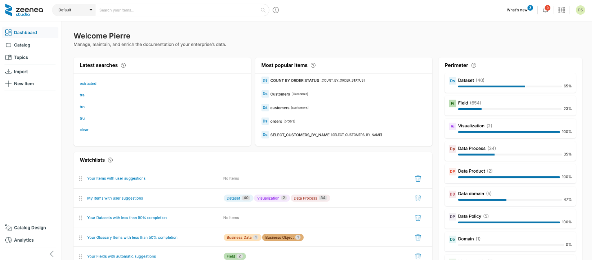
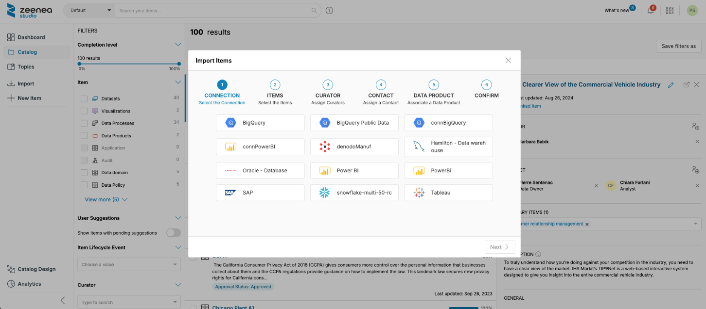

# As a Data Steward

As a Data Steward of the Zeenea suite, you have specific rights and permissions. 

Data stewards are responsible for documenting and managing the catalog items assigned to them.

## Requirements

Before starting in Zeenea as a Data Steward, a few requirements must be met:

* Your user account must be associated with a group of type "Data Steward"
* At least one scanner must be installed and connected to your catalog (see our article about Scanners)
* The metamodels of your items must be defined (see our article Configure a metamodel (template))
* Responsibilities to be assigned to contacts in the catalog must be defined (see our article Create, edit or delete responsibilities)
* An inventory of the connection(s) for which you are responsible as Data Steward must have been made by an administrator (see our article Create, manage or delete a connection)
* Once these conditions have been met, you can proceed with the steps below.

## Step 1: Log in to your Dashboard

The dashboard is the home page of the Data Steward's Zeenea Studio application. 

Once logged in, you will find on this page the main management indicators of your perimeter.

It is therefore your main entry point to access the datasets for which you are responsible as Data Steward.

  

### Browse the catalog items 

1. Log in to the **Catalog** section of the left menu to explore the items already imported 
2. Discover the connections and items already in place between your information system and the catalog.

## Step 2: Import items from a connection

If you are responsible for curation and import on one or more connections, start selecting the items you want to document first using our import path.

  

For more details on importing items into the catalog, read Importing "Datasets" or "Visualization" items into Zeenea

## Step 3: Select the items for which you are responsible

Before you start documenting items, they must be assigned to you as a Contact with the appropriate responsibility, depending on your organization.

* If datasets have been assigned to you: a link allows you to access them directly from your dashboard.
* If no item has been assigned to you yet: log in to the "Catalog" section and use the filters to find the desired items.

Then you should be able to try the following features:

* [Adding contact item by item or in bulk](../Stewardship/zeenea-editing-items-in-bulk.md)
* [Search and filters](../Stewardship/zeenea-studio-search.md)

## Step 4: Start documenting your perimeter

Once your perimeter is defined, you can start its documentation.

For more details on item documentation, see [Understanding the Documentation of an Item](../Stewardship/zeenea-item-documentation.md).

  
