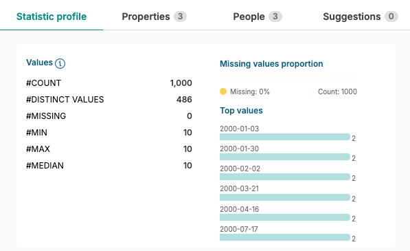
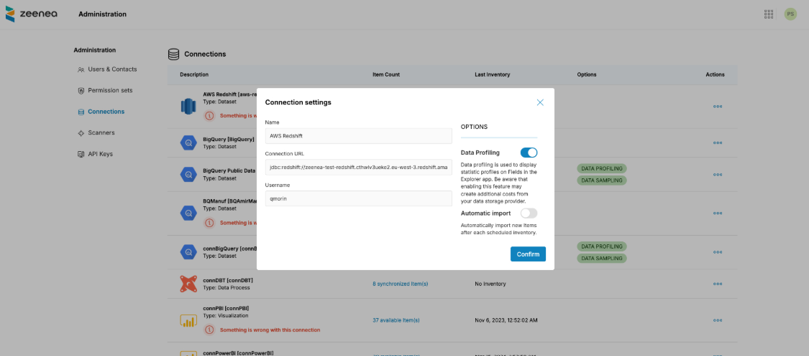
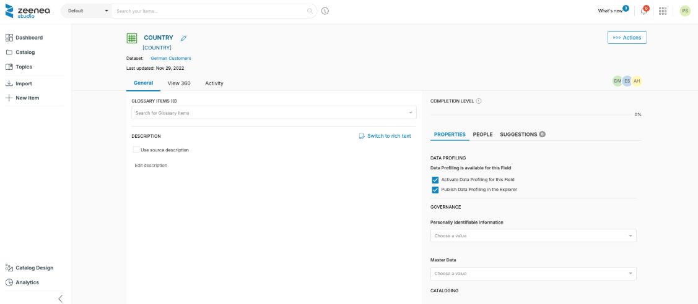

# Data Profiling

Data Profiling allows you to understand a data sample better, in order to more easily detect issues, risks, and general trends related to Data Quality. It hence converts data into key insights. 

These insights are displayed graphically for each field of a dataset and will show information such as: 

* Top values*
* Number of values for each field**
* The mean*
* The minimum*
* The maximum*
* The median*
* The standard deviation
* Data distribution***
* etc.

\* Approximated through a sample 
\*\* Only the number of values in a field is an actual statistic 
\*\*\* Box-plots and bar charts are only available for numerical values

## Available Graphical Analysis

### Progress Bar

This chart shows the proportion of empty values compared to the number of counted values. 

When there are **multiple missing values inside a field, the bar is then coloured in bright yellow**, enabling you to quickly identify the issue. 

### Horizontal Bar Charts

These charts will display the 6 most common values in a text-type field. 

These are the most common in the sample, not in the entirety of the field.

### Vertical Bar Charts

These charts will show how the data is distributed in numerical fields. They provide information on the total value amount, spread from the minimum value to the maximum one. 

### Box plots

Box plots give a comprehensive view of statistical information, simply and visually. They complement vertical bar charts.  

They especially focus on the first and third quartile as well as the median. The whiskers themselves are calculated by multiplying the IQR (Inter Quartile Range) by 1.5. 

> **Note:** If the data doesn't extend beyond their extremities, then the whiskers take the minimum and maximum value of the data.

## Enabling Data Profiling

For the Data Profiling feature to work, you will need to make sure of the following: 

* The source, as the fields you wish to run the Data Profiling on, are compatible (cf. "Data Profiling-compatible technologies")
* The scanner has been set up with the necessary permissions to extract a data sample
* The Data Profiling on the connection itself has been activated 
* Data Profiling has been enabled in every field where it is relevant. This is done by Data Stewards, on Zeenea Studio, using the option "Activate Data Profiling for this Field".

In the image above, the option "Publish Data Profiling in the Explorer" will allow your Data Explorers to have access to the various charts for each specific field. 

## How to manually execute a Data Profiling job?

Data Profiling is automatically run based on the connector's configuration. However, it is possible for admins to manually launch the job from the Connections page in the Zeenea Admin interface. 

## Data Profiling-compatible technologies

This feature is available for the following connectors: 

* BigQuery
* Greenplum
* PostgreSQL
* AWS Redshift
* Snowflake
* SQL Server
* DB2
* Oracle
* Netezza
* Teradata

For each connector, below is the list of fields available for Data Profiling:

| Connector | Supported types |
| :--- | :--- |
| BigQuery | `INT64` `FLOAT64` `STRING` `(mode != REPEATED)` |
| Greenplum AWS Redshift Snowflake Sql Server | `INTEGER SERIAL` `SMALLSERIAL TINYINT` `SMALLINT MEDIUMINT INT` `YEAR MONTH DAY HOUR` `MINUTE SECOND INT2 INT4` `TINYINT\(([0-9]*)\) if $1 > 1` `BIGINT INT8 BIGSERIAL` `FLOAT BINARY_FLOAT FLOAT\`   `(([0-9]*)\)`   `DOUBLE REAL DOUBLE PRECISION BINARY_DOUBLE` `CHAR VARCHAR VARCHAR2` `TEXT ENUM SET NCHAR` `NCHAR2 NVARCHAR` `NVARCHAR2 NTEXT CLOB` `NCLOB CHARACTER VARYING\` `([0-9]*\) VARCHAR\([0-9]*\)` `NVARCHAR\([0-9]*\)` `VARCHAR2\([0-9]*\)` `NVARCHAR2\([0-9]*\)` `CHARACTER\([0-9]*\) CHAR\([0-9]*\)` `NCHAR\([0-9]*\) NCHAR2\([0-9]*\)` |
| PgSql | `int4` `int8 oid tid xid cid oidvector` `txid_snapshot` `float4` `float8` `char name text json xml bpchar` `varchar` |
| SqlDb2 | `INTEGER` `BIGINT` `REAL` `DOUBLE` `CHARACTER si CODEPAGE=0` `VARCHAR si CODEPAGE=0` `CLOB GRAPHIC VARGRAPHIC` `DBCLOB XML` |
| DsnDb2 | `INTEGER` `BIGINT` `REAL FLOAT si LENGTH=4` `DOUBLE FLOAT si LENGTH=8` `DECFLOAT` `CHAR VARCHAR LONGVAR` `GRAPHIC VARG VARGRAPH` `LONGVARG CLOB DBCLOB` `XML` |
| Oracle | 	`BINARY_FLOAT` `BINARY_DOUBLE FLOAT` `CHAR CLOB NCHAR NCLOB` `NVARCHAR2 VARCHAR2` |
| Netezza | `INT4 _INT4INT8 OID TID XID` `CID OIDVECTOR` `FLOAT4` `FLOAT8` `CHAR NAME TEXT BPCHAR` `VARCHAR NCHAR NVARCHAR` |
| Teradata | 	`DH DM DS DY HM HS HR I MI` `MO MS SC YM YR` `I8` `F` `CF CO CV JN XM` |