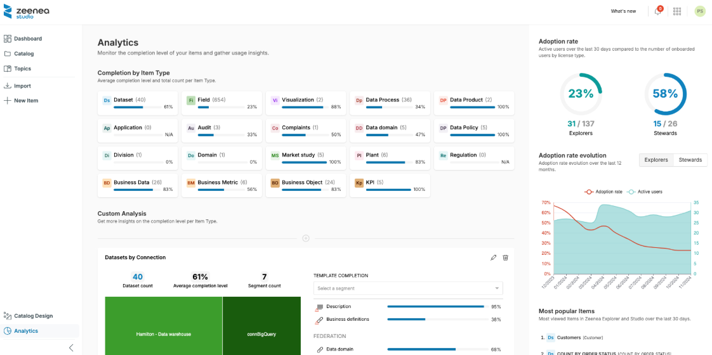

Analytics Dashboard
========================

The analytics dashboard can be accessed from the left-hand menu bar by clicking on the "Analytics" icon.

Access to this dashboard is conditional on activating specific permission from the Administration interface.

The analytical dashboard is divided into two sections:

* Left: Catalog content analysis
* Right: Catalog adoption analysis

## Content Analysis

### Completion level by Item Type

By default, the dashboard shows, by Item type, the total count of Items created or imported into the catalog, as well as the completion level defined for each type.

Click on one of the cards to access the corresponding list of Items.

### Custom analysis

From this dashboard, you can create customized analyses of the completion level of your Items.

To do so, click on the **Add widget** button, then enter the following information: 

* Item Type: The type of Item you wish to analyze
* Property used for segmentation: The completion level will be calculated according to the possible values for this criterion. The available criteria are:
  * The connection
  * The "Select" properties of the template for the selected Item type
  * The catalog (when the Federated Catalog is activated)

Once created, the left-hand side of the widget graphically displays the distribution of values (segments) for the selected criterion and, for each of these segments, the completion level.

On the right, the widget details the completion rate property by property for the selected type (including the description and the links with Glossary Items or Business definitions). 

Click on one of the segments in the chart, or select a value from the "Select a segment" drop-down list to filter values on a particular segment.

Click the **Add widget** button again to create a new analysis above or below the previous one.

## Adoption analysis

The right-hand side of the dashboard features several widgets for analyzing catalog adoption.

### Adoption rate

The first widget shows the catalog's user adoption rate, depending on their license type (Explorer or Steward), calculated as follows:

`Adoption rate = Number of active users / Number of onboarded users`

The widget also shows the total number of onboarded users and the total number of active users.

### Adoption rate evolution

This widget shows the history of the adoption rate and active users over 12 months for both license types.

### Most popular Items

This widget lists, in descending order, the assets (Datasets, Visualizations, Processes, Categories, Data Products) most frequently consulted by catalog users (Explorer and Studio).

### Most frequent searches

This widget lists, in descending order, the most frequent searches in the Studio and Explorer applications.