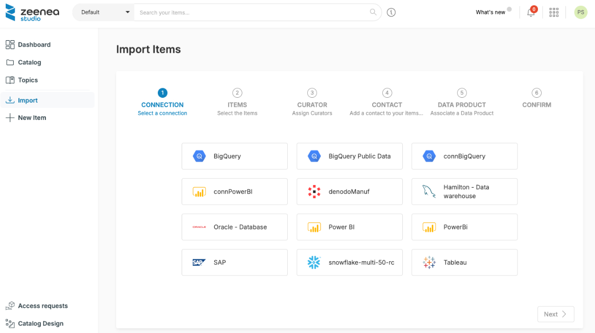

# Importing Datasets or Visualizations

## Requirements 
To import Datasets or Visualizations  into Zeenea, you must first: 

1. Install a scanner.
2. Install the plugin of the connector that is appropriate to your storage system.
3. Configure a connection to your storage system.
4. Launch an inventory of this connection to allow the connector to automatically discover the Items available for import.

These steps are described in the sections: [Zeenea Scanner Setup](../Scanners/zeenea-scanner-setup.md) & [Managing Connections](../Zeenea_Administration/zeenea-managing-connections.md).

## Import datasets or visualizations

If the requirements are met, you can access the import wizard by clicking the "Import" button from Zeenea Studio, and then clicking on “Select a connection”. Only specific profiles are allowed to import items into Zeenea.

  

### Step 1: Connection

First, select the connection corresponding to the items to be imported.

Some specifics about this step: 
* Only connections that work with an inventory are proposed, namely those of the "dataset" or "visualization" type. The other "synchronized" connections are automatically imported in an all-or-nothing mode. 
* Connections with automatic import activated are grayed out. If necessary, it is possible to force an automatic import from the administration interface.

### Step 2: Items

Search for the items either:

* by browsing the folders (by clicking on their name) 
* by using the search bar
* Select the items to import:  
    * individually: Click on the cross next to an item 
    * in bulk: Click on "Add all" to add the items in a folder to your import 

Select the **Show already imported** checkbox to view the items already imported in the catalog.

### Step 3: Curators (Optional)

You can now add one or more Curators to datasets when importing them. These will be the Stewards in charge of documenting the imported datasets. 

> **Note:** If a user requesting the import does not have permission to edit unassigned items, they will be automatically set as a curator for these newly-imported items.

### Step 4: Contact (Optional)

It is possible to associate a contact and a responsibility to the datasets resulting from your selection. 

### Step 5: Category (Optional)

For datasets only, it is possible to specify a category among those already created.

### Step 6: Confirm

Before final confirmation, a summary of the operations to be carried out is proposed in the last stage.

> **Important:** After confirmation, the window is closed and the import is performed asynchronously. The operation may take several minutes depending on the number of items selected.

## Specificities of certain imports

For datasets:

* For these imports, the fields are also imported automatically. Once associated with the source dataset, the fields also become searchable items in Zeenea.
* For some connections, the automatic import of the Data processes associated with this dataset is possible (ex: Atlas)

For visualizations: 

* The import of visualizations, if the connection allows it, can also include the associated datasets and their fields.

The imported items appear progressively in the Catalog section. Once the import is completed, a notification is sent with the number of imported items and the number of failures, if any. This notification makes it easy to find the list of imported items.