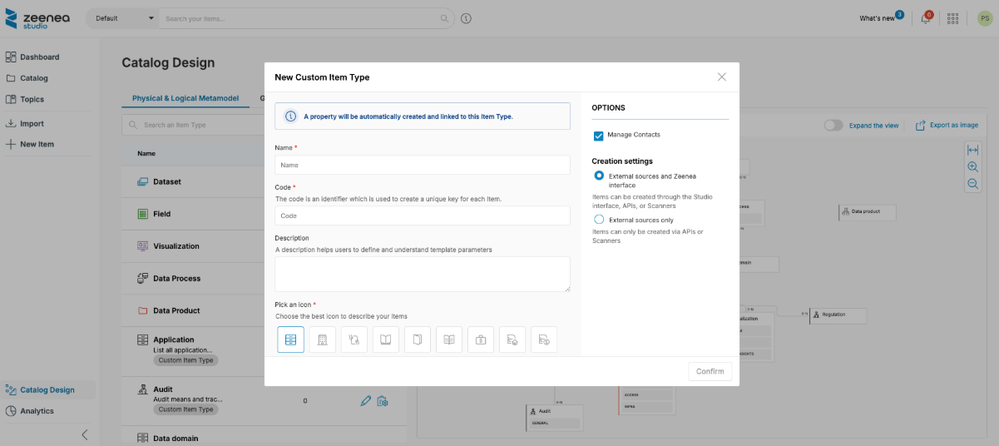

# Creating or Deleting a Custom Item Type

In addition to the native item types supported by the catalog, Zeenea allows you to configure custom item types to categorize, contextualize, and enrich the documentation of your data assets.

Indeed, Custom Item Types allow you to enrich the metamodel by representing technical or structural concepts that are specific to your company (e.g., applications, entities, processes).

These types of items can be used to create links between them and any other item type in the catalog, and thus represent hierarchical relationships or links, or be used in the representation of a lineage. 

## How to create a custom item type

1. Go to the Catalog Design section.
2. Select the Physical & Logical Metamodel subsection.
3. Click the **New Custom Item Type** button.
4. Enter the requested information and then click **Confirm**.

  

## General information

Fill in the following information:

* **Name**: This name will be used in Zeenea applications to designate this new type of item
* **Code**: This mandatory code allows this Item Type to be uniquely identified. It is used by scanners to synchronize this type of Item from a repository. It is also used as a part of the Item identification keys
* **Description**: Displayed for Zeenea Studio users
* **Icon**: The selected icon will be used for all items created for this type
* **Manage Contacts**: Leave this option enabled if you want to manage contacts on items of this type

## Creation settings

You can create your custom items manually or synchronize/import them automatically from your repository from a connection:

* External sources and Zeenea interface: Choose this option if you want to allow your objects to be created from the Studio interface ("New Item" function or Excel import) and from external systems (API and scanner).
* External sources only: Choose this option if you want to restrict the creation of objects to external sources (API and scanner).

## How to modify a custom item type

Once a new custom item type has been created, you can still modify its characteristics by clicking on the "Edit" icon in front of each custom type name in the Catalog Design / Physical & Logical Metamodel section.

## How to delete a custom item type

You can delete a custom item type from its edit screen if it meets the following conditions:

* There are no (or no more) items of this type in the catalog.
* The property from this custom type is not used in a metamodel.

> **Important:** Deleting a custom type automatically deletes its associated property as well as all indexed values for that property.

## Custom Item associated property

The creation of a custom item type automatically leads to the creation of an assignable "Property" in the metamodels: 

* The name, code, and description are inherited from the newly created item.
* This is an **Internal Link** property. By default, it is single-valued. You can choose to make it multivalued.
* The **Use in search queries** option is not yet supported for custom types. 

The properties resulting from the creation of custom types can be identified through the "Source" column.

  
