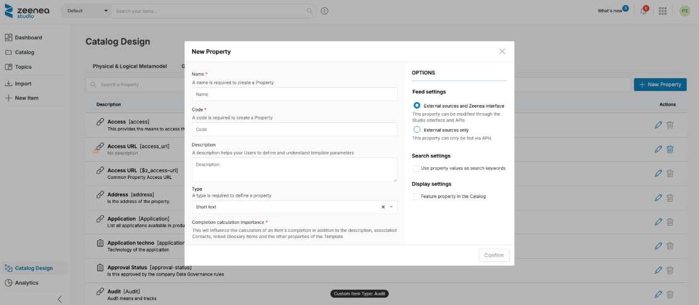

# Creating, Editing, or Deleting a Property

A property is a component of the metamodel used to store metadata specific to a given item. It allows providing context and/or categorizing the items in the catalog. The properties are also used as search criteria or filters and thus provide more efficient access to items.

## Creating a New Property

1. Click the **New Property** button to access the property creation screen:

    

2. Complete the following fields: 

     * Name (unique and required)
     * Code (unique and required)
     * Description
     * Type (required)
     * Completion calculation importance (mandatory)
     * Options (according to the type)

These fields are detailed in the following sections.

### Name

A property is defined by a name.  

This will be the name displayed to users, whether they are Data Explorers or Data Stewards. This name is therefore important and must have a rather straightforward meaning for users.

### Code

A property is also defined by a code.  

This code is a technical identifier and can be used in particular in API queries.

### Description

The description helps users to better understand the meaning of the property. It is displayed as a tooltip next to each property when it is added to a metamodel. 

### Type

There are different types of properties (Short Text, URL, Number, etc.). This allows to indicate the meaning of this information within the company and thus to optimize the indexing and usability of this information for Data Stewards and data consumers. 

* Short Text: Short text, useful for acronyms and short alphanumeric values
* Rich Text: Rich text, offers some easy layout options. Allows you to create a larger documentation while remaining readable
* Number: Only for numerical values
* URL: A hypertext link to a Web resource
* List of values (Enumeration): A finite list of values that can be configured, thus limiting the editing possibilities of the Data Steward. Improves the quality of the documentation by structuring the possibilities. Please note that to add a value for a property of this type, simply enter it in the dedicated field and validate it by pressing the "Enter" key. It will then appear in a box, confirming that it has been properly integrated.
* List of values (multivalued): Finite list of configurable values. Unlike the "List of values" type, this type allows you to select several values of this property for the same item.
* Date: Date with formatting that will change depending on tenant language

  | Tenant language | Date format |
  | :--- | :--- |
  | English | yyyy-mm-dd (ISO 8601) | 
  | French | dd/mm/yyyy |
  | German | dd.mm.yyyy |

### Completion Calculation Importance

* **Ignore**: The Property is optional and is not taken into account in the completion level
* **Standard**: The Property is taken into account in the calculation of completion level
* **Important**: The property is also taken into account in the calculation of the completion level. An important property will count twice compared to a standard property is the calculation

### Options

#### Feeding options
* **External sources and Zeenea interface**: The property can be updated via Zeenea Studio or by API
* **External sources only**: The property can be modified by API only

#### Search Options

For each property, it is possible to customize how you use it for searching in the Studio and Explorer.

Be aware that misuse of these options can degrade the search engine performance of the search engine, as well as the user experience.

Below you will find a description of these options, as well as some advice on how to use them:

* Use property values as search keywords: This option allows users to type the value of a property into the search bar to find matching Items. Use this option best for "Short Text" properties corresponding to data of type "identifier" or short character strings. We do not recommend using this option when the property contains complex strings. That will degrade the relevance of the search results. Overusing this option may also downgrade the response times of the search engine and therefore downgrade the user experience. In particular, for "Select" or "Multiselect" properties, use the "Use property as a search filter" option.
* Use property as a search filter: This option allows using the property as a search filter to refine the results. Use this option, if necessary, for "Select" or "Multiselect" properties. Avoid using this option for "Short Text" properties, especially if there are a lot of possible values. That may degrade the performance of the engine.

#### Display Options

* **Feature property in the Catalog**: The value of the property, as well as its name, will be visible directly in the search results and highlighted in the Items details pages. Use this option to promote the most important properties for users, especially as a discriminator between Items with similar characteristics. "Highlighting too many properties can impair the readability of search results. Similarly, use this option best for "Select" or "Multiselect" properties.

## Deleting a Property

It is possible to completely remove a property from the catalog, as well as the indexed values for this property.

This operation is done from the **Properties** section of the **Catalog Design** page:

* From the **Actions** column, by clicking on the trashcan icon.
* From the property edit screen by clicking on the "Delete" button.

To be deleted, a property must meet four conditions:

* It must not be associated with a metamodel. If necessary, remove the property from the metamodels from the "Item Types" menu.
* It must not be used by a connector. If necessary, remove the connector from your Scanner.
* It must not be linked to a custom item type. If necessary, deleting the item type allows you to delete the associated property automatically.
* It must not be a native property of the catalog (ex: Personally Identifiable Information).

Before deleting the property, a confirmation window will ask you to confirm your choice. The indexed values for this property will be permanently deleted in a background task.

## Source Property Management

When a new connector is installed, it also automatically creates a list of properties in the Metamodel section. These so-called "source" properties are created with default information (name, code, etc.), some of which are editable and some not.

The following information is editable: 

* Name
* Description
* Options

Other information is read-only: 

* Code (prefixed by $z_)
* Type
* Importance in completion calculation

> **Note:** Once the name or description has been modified, the value from the connector can be restored by clearing the corresponding form field.
 