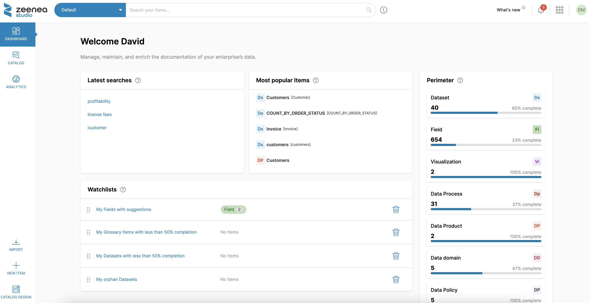

# Zeenea Studio Overview

Zeenea Studio is Zeenea Data Catalog's back office management interface.

  

Zeenea Studio is designed for your data management teams and more specifically for Data Stewards to manage, maintain and enrich the documentation of a data asset.

## Main uses

* Inventory datasets and other enterprise assets (Discover the items managed by Zeenea).
* Transform technical and operational metadata collected from source systems into readable and searchable documentation for data catalog items.
* Create documentation metamodels to be filled in on the items inventoried in Zeenea.
* Link business definitions, called Business Terms, from the Zeenea Business Glossary to the items in the data catalog.
* Associate referrers and contacts to the items in the data catalog.
* Be the privileged space for collaboration between the company's internal requests and questions and the knowledgeable.

## Zeenea Studio Demo

See [Discover Zeenea Data Catalog in 8 minutes (Product Demo)](https://www.youtube.com/watch?v=u5DMqZDCBYs).

